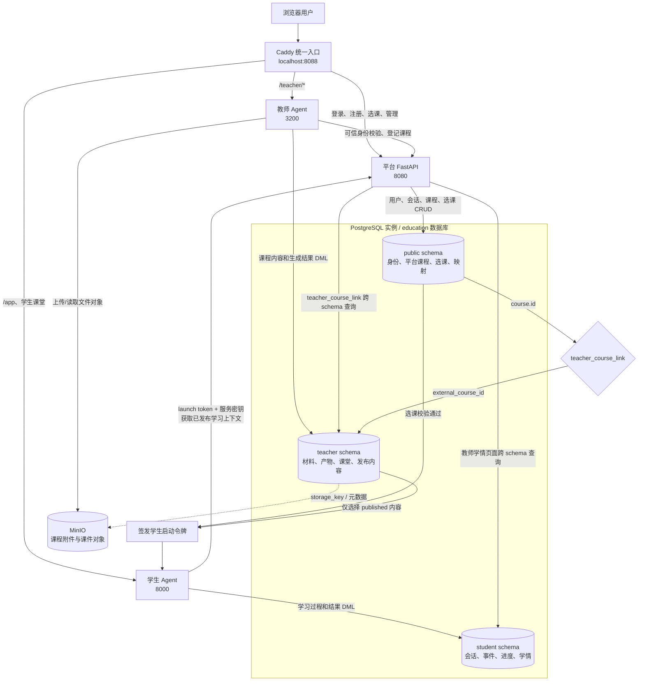

# 数据库与数据流说明

完整字段级中文 ER 图参见：[完整中文 ER 图](./database-er-diagram.md)。

> 核验日期：2026-09-25。本文同时依据当前运行中的 PostgreSQL、Alembic 迁移和三个服务的实际读写代码整理。

## 1. 当前有哪些数据库与存储

本地 Docker 中只有一个 PostgreSQL 实例，容器名为 `agentedu-final-database-1`，宿主机端口为 `55432`。

| 数据库 | 用途 |
| --- | --- |
| `education` | 正式业务主库，平台、教师 Agent、学生 Agent 共同使用 |
| `app_test` | 自动化测试数据库，不承载正式业务数据 |
| `postgres` | PostgreSQL 默认维护数据库，不承载平台业务 |

`education` 通过 schema 划分数据所有权：

| Schema | 主要写入方 | 内容 |
| --- | --- | --- |
| `public` | 平台 FastAPI | 用户、登录会话、平台课程、选课关系、课程映射、章节和平台 Agent 会话 |
| `teacher` | 教师 Agent | 教师课程详情、材料、PPT/产物、课堂、发布包、知识图谱和教师 Agent 会话 |
| `student` | 学生 Agent | 学习会话、对话、学习事件、播放进度、掌握度、任务提交和课后报告 |

此外还有两个非关系型数据服务：

- **MinIO**：保存课程原始附件、PPT 等二进制对象；PostgreSQL 保存对象的业务归属、文件名、哈希和存储键等元数据。旧数据仍可能保留在 PostgreSQL `BYTEA` 字段中。
- **Mailpit**：本地开发邮件收件箱，不是业务数据库。

## 2. 总体数据流图

图中的关键原则是：三个 schema **不会自行同步**。数据关联与流转由平台接口、Agent 服务和 `teacher_course_link` 映射完成。

## 3. public schema：平台主数据

### 核心表

| 表 | 作用 | 主要关系 |
| --- | --- | --- |
| `user` | 用户、密码哈希、角色、管理员状态 | 被课程、选课、会话引用 |
| `browser_session` | 可撤销的浏览器登录会话 | `user_id -> user.id` |
| `emailverification` | 注册邮箱验证码 | 按邮箱和有效期校验 |
| `course` | 平台课程目录、教师归属、选课码 | `owner_id -> user.id` |
| `teacher_course_link` | 平台课程 ID 与教师 Agent 课程 ID 的唯一映射 | `course_id -> course.id`；`external_course_id -> teacher.mentra_courses.id` 为逻辑关系 |
| `enrollment` | 学生选课关系 | `course_id -> course.id`，`student_id -> user.id` |
| `chapter` | 平台课程章节 | `course_id -> course.id` |
| `chapterprogress` | 学生章节完成状态 | 关联章节和学生 |
| `agentsession` | 平台统一 Agent 会话索引、所有权和并发 lease | 关联用户和业务 scope |
| `asset_entries`、`asset_blobs` | 平台资产元数据/兼容性存储 | 当前没有数据 |
| `item` | FastAPI 模板遗留的通用示例表 | 与核心教学流程无关 |
| `course_identity_repair_backup` | 课程身份修复时留下的备份表 | 运维/迁移用途 |
| `alembic_version` | 数据库迁移版本 | Alembic 管理 |

### 当前准确记录数

| 数据 | 数量 |
| --- | ---: |
| 用户 | 63 |
| 平台课程 | 13 |
| 选课关系 | 50 |
| 教师课程映射 | 13 |
| 浏览器会话 | 224 |

## 4. teacher schema：教师课程内容

### 课程与材料

- `mentra_courses`：教师 Agent 的完整课程对象，`payload JSONB` 保存课程结构。
- `mentra_material_extractions`：上传材料的解析结果。
- `mentra_course_material_files`：材料文件元数据及旧版 `BYTEA` 内容。
- `mentra_course_lesson_files`：课时级文本文件和生成内容。

### 生成产物与发布

- `mentra_artifact_jobs`：PPT 等生成任务和状态。
- `mentra_course_artifacts`：生成产物、发布状态、classroomId 等。
- `mentra_artifact_files`：产物文件元数据及旧版 `BYTEA` 内容。
- `mentra_classrooms`：播放器所需的 stage、scenes 和动作数据。
- `mentra_knowledge_packages`：面向学生发布的版本化知识包。

### 知识图谱

- `mentra_course_graph_versions`
- `mentra_course_graph_jobs`
- `mentra_course_graph_nodes`
- `mentra_course_graph_edges`
- `mentra_course_graph_evidence`

### 权限与教师 Agent 会话

- `mentra_course_access_grants`：课程访问授权。
- `mentra_teacher_agent_sessions`
- `mentra_teacher_agent_entries`
- `mentra_teacher_agent_events`
- `mentra_teacher_agent_owner_counters`
- `mentra_teacher_agent_owner_events`
- `mentra_teacher_agent_urls`

### 当前准确记录数

| 数据 | 数量 |
| --- | ---: |
| 教师课程 | 18 |
| 课程产物 | 35 |
| 已保存课堂 | 7 |
| 知识包 | 5 |
| 知识图谱节点 | 约 2491 |
| 知识图谱边 | 约 307 |
| 知识图谱证据 | 约 2345 |

`mentra_course_material_files` 当前约占 87 MB，是数据库中最大的表，说明已有材料二进制或较大的文件数据仍保存在 PostgreSQL。新文件应优先进入 MinIO，数据库只保留元数据和 `storage_key`。

## 5. student schema：学生学习数据

| 表 | 内容 | 幂等/唯一依据 |
| --- | --- | --- |
| `student_sessions` | 学生、课程、发布版本、课堂和会话时间 | `session_key` |
| `student_messages` | 学生与 Agent 的对话流水 | `session_key + seq` |
| `learning_events` | 开课、发言、播放和掌握事件 | `session_key + event_type + event_id` |
| `playback_progress` | 播放到的 scene/segment | `session_key + scene_id` |
| `knowledge_mastery` | 知识点星级、状态和证据 | 用户 + 课程 + 发布版本 + 知识点 |
| `task_submissions` | 学生任务提交和评分 | 提交 ID |
| `after_class_reports` | 每次课堂的课后报告 | `session_key` |

当前数据：50 个学生会话、41 条对话、102 条学习事件、4 条播放进度、3 份课后报告；知识掌握和任务提交仍为 0，说明这两条链路尚未产生有效测试数据或尚未完整启用。

## 6. 三条核心业务数据链

### 6.1 教师创建并发布课程

1. 教师在平台登录，身份写入 `public.user`，浏览器会话写入 `public.browser_session`。
2. 教师进入教师 Agent；教师端向平台校验 cookie 和课程归属，前端传入的 `teacherId` 不作为可信身份。
3. 教师 Agent 创建 `teacher.mentra_courses`。
4. 教师端调用平台内部课程登记接口；平台创建 `public.course`，并写入 `public.teacher_course_link`。
5. 材料解析、PPT、知识图谱和课堂分别写入 teacher schema；大文件写入 MinIO。
6. 发布后形成 `mentra_knowledge_packages`、已发布 `mentra_course_artifacts` 和 `mentra_classrooms`。

### 6.2 学生选课并进入学习

1. 学生通过选课码加入，平台写入 `public.enrollment`。
2. 点击进入学习时，平台校验用户身份、`enrollment` 和课程发布状态。
3. 平台通过 `teacher_course_link.external_course_id` 查找 teacher schema 中对应课程。
4. 平台只读取 `status = published` 的知识包、产物和课堂，并签发绑定 `userId + courseId + classroomId` 的短期令牌。
5. 学生 Agent 使用服务密钥和启动令牌向平台获取学习上下文，不能自行指定学生 ID 或读取未发布内容。
6. 播放器按课堂 `scenes/actions` 播放；学生 Agent 把会话、对话、事件、播放进度和课后报告写入 student schema。

### 6.3 教师查看学情

1. 平台先根据 `public.course.owner_id` 确认教师拥有课程。
2. 以统一的 `public.course.id` 查询 `student.student_sessions`、事件、进度、掌握度、任务和报告。
3. 聚合结果展示到教师课程详情或授课管理页面。

## 7. 当前发现的数据一致性情况

| 检查 | 结果 |
| --- | ---: |
| teacher 课程没有平台映射 | **5** |
| 平台课程没有 teacher 映射 | 0 |
| 映射指向不存在的 teacher 课程 | 0 |
| 选课指向不存在的平台课程 | 0 |

因此当前 13 门平台课程都能对应教师课程，但 teacher schema 中另有 5 门历史/迁移课程没有进入平台目录。这些记录不会自然出现在平台课程页，也可能导致直接从教师端看到的课程数与平台不同。

建议后续为这 5 门课程执行一次明确的认领或归档流程：能够确定教师账号的课程补建 `public.course + teacher_course_link`；无法确定归属的课程保持隔离并标记为待认领，不能随意绑定给某个教师。

## 8. 数据所有权规则

- 表结构（DDL）统一由平台 Alembic 迁移维护。
- 平台角色管理 `public`，教师服务账号只对 `teacher` 执行必要 DML，学生服务账号只对 `student` 执行必要 DML。
- Agent 不直接修改 `public.user`、`course` 或 `enrollment`。
- 平台可以为鉴权、课程桥接和学情展示执行跨 schema 的只读查询。
- 跨 schema 业务关系目前部分是逻辑外键，删除和迁移课程时必须经过服务层，避免产生孤立数据。
