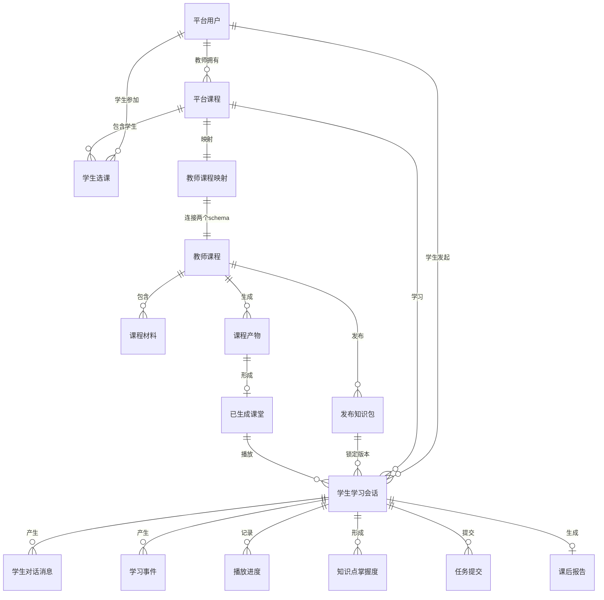
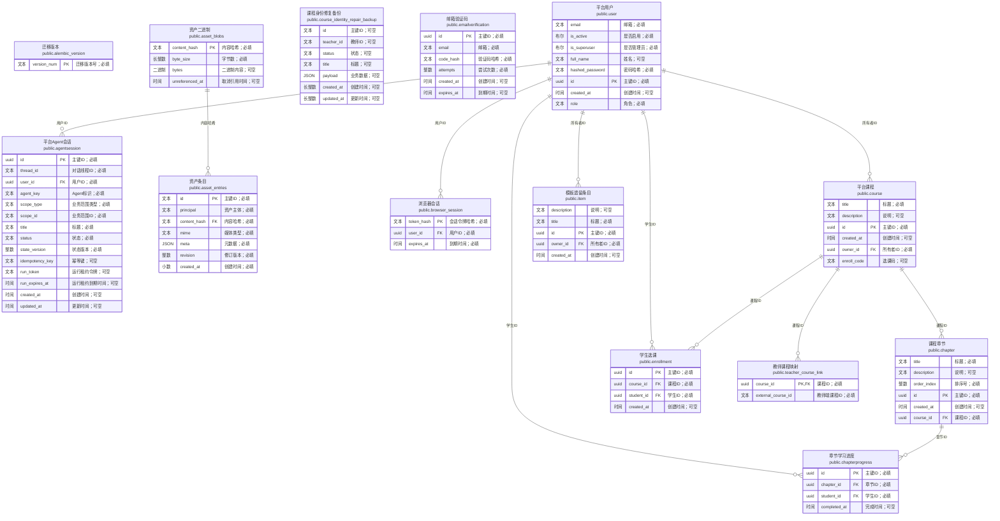
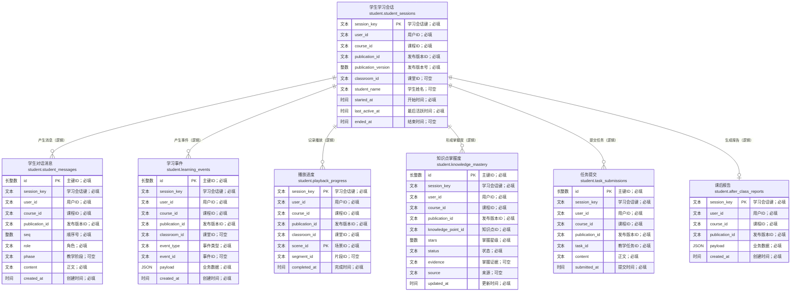

# 完整中文 ER 图

> 生成时间：2026-09-25。来源为当前 `education` 数据库。图中 `PK`、`FK` 表示数据库真实约束；标有“逻辑”的连线由服务代码维护，数据库暂未建立物理外键。

由于数据库共有 42 张表，一张图同时显示所有字段会难以阅读，因此拆成总览和三个 schema 详细图。三张详细图合计覆盖当前数据库的全部表和全部字段。

## 一、跨服务核心关系总览

## 二、平台 public schema（全部表与字段）

## 三、教师 teacher schema（全部表与字段）

教师 schema 当前主要依靠 ID 和服务层维护关系，绝大多数关联是逻辑关联。

```mermaid
erDiagram
    TEACHER_MENTRA_ARTIFACT_FILES["产物文件<br/>teacher.mentra_artifact_files"] {
        文本 storage_key PK "对象存储键；必填"
        文本 artifact_id "产物ID；必填"
        文本 file_name "文件名；必填"
        文本 mime_type "媒体类型；必填"
        长整数 size_bytes "文件大小；必填"
        文本 sha256 "文件SHA256；必填"
        二进制 bytes "二进制内容；可空"
        长整数 created_at "创建时间；必填"
        长整数 updated_at "更新时间；必填"
    }
    TEACHER_MENTRA_ARTIFACT_JOBS["产物生成任务<br/>teacher.mentra_artifact_jobs"] {
        文本 id PK "主键ID；必填"
        文本 course_id "课程ID；必填"
        文本 teacher_id "教师ID；必填"
        文本 artifact_type "产物类型；必填"
        文本 status "状态；必填"
        JSON payload "业务数据；必填"
        长整数 created_at "创建时间；必填"
        长整数 updated_at "更新时间；必填"
    }
    TEACHER_MENTRA_CLASSROOMS["已生成课堂<br/>teacher.mentra_classrooms"] {
        文本 id PK "主键ID；必填"
        文本 course_id "课程ID；可空"
        文本 artifact_id "产物ID；可空"
        JSON stage "课堂舞台；必填"
        JSON scenes "课堂场景；必填"
        JSON payload "业务数据；必填"
        长整数 created_at "创建时间；必填"
        长整数 updated_at "更新时间；必填"
    }
    TEACHER_MENTRA_COURSE_ACCESS_GRANTS["课程访问授权<br/>teacher.mentra_course_access_grants"] {
        文本 id PK "主键ID；必填"
        文本 tenant_id "租户ID；必填"
        文本 course_id "课程ID；必填"
        文本 subject_type "授权主体类型；必填"
        文本 subject_id "授权主体ID；必填"
        文本 role "角色；必填"
        长整数 created_at "创建时间；必填"
        长整数 expires_at "到期时间；可空"
    }
    TEACHER_MENTRA_COURSE_ARTIFACTS["课程产物<br/>teacher.mentra_course_artifacts"] {
        文本 id PK "主键ID；必填"
        文本 job_id "任务ID；必填"
        文本 course_id "课程ID；必填"
        文本 teacher_id "教师ID；必填"
        文本 artifact_type "产物类型；必填"
        文本 status "状态；必填"
        JSON payload "业务数据；必填"
        长整数 created_at "创建时间；必填"
        长整数 updated_at "更新时间；必填"
    }
    TEACHER_MENTRA_COURSE_GRAPH_EDGES["知识图谱关系<br/>teacher.mentra_course_graph_edges"] {
        文本 course_id PK "课程ID；必填"
        整数 graph_version PK "图谱版本；必填"
        文本 id PK "主键ID；必填"
        文本 source_node_id "起点节点ID；必填"
        文本 target_node_id "终点节点ID；必填"
        文本 relation_type "关系类型；必填"
        JSON properties "扩展属性；必填"
        长整数 created_at "创建时间；必填"
    }
    TEACHER_MENTRA_COURSE_GRAPH_EVIDENCE["知识图谱证据<br/>teacher.mentra_course_graph_evidence"] {
        文本 course_id PK "课程ID；必填"
        整数 graph_version PK "图谱版本；必填"
        文本 id PK "主键ID；必填"
        文本 node_id "节点ID；必填"
        文本 material_id "材料ID；必填"
        文本 chunk_id "材料分块ID；必填"
        整数 page "页码；可空"
        整数 slide "幻灯片号；可空"
        文本 source_sha256 "来源SHA256；必填"
        文本 excerpt "证据摘录；可空"
    }
    TEACHER_MENTRA_COURSE_GRAPH_JOBS["知识图谱生成任务<br/>teacher.mentra_course_graph_jobs"] {
        文本 id PK "主键ID；必填"
        文本 course_id "课程ID；必填"
        文本 teacher_id "教师ID；必填"
        整数 graph_version "图谱版本；必填"
        文本 session_id "会话ID；必填"
        文本 status "状态；必填"
        文本 phase "教学阶段；必填"
        整数 progress "进度；必填"
        JSON payload "业务数据；必填"
        长整数 created_at "创建时间；必填"
        长整数 updated_at "更新时间；必填"
    }
    TEACHER_MENTRA_COURSE_GRAPH_NODES["知识图谱节点<br/>teacher.mentra_course_graph_nodes"] {
        文本 course_id PK "课程ID；必填"
        整数 graph_version PK "图谱版本；必填"
        文本 id PK "主键ID；必填"
        文本 node_type "节点类型；必填"
        文本 title "标题；必填"
        文本 description "说明；可空"
        文本 module_id "模块ID；可空"
        文本 lesson_id "课时ID；可空"
        文本 status "状态；必填"
        JSON properties "扩展属性；必填"
        长整数 created_at "创建时间；必填"
        长整数 updated_at "更新时间；必填"
    }
    TEACHER_MENTRA_COURSE_GRAPH_VERSIONS["知识图谱版本<br/>teacher.mentra_course_graph_versions"] {
        文本 course_id PK "课程ID；必填"
        整数 version PK "版本号；必填"
        文本 status "状态；必填"
        文本 title "标题；必填"
        文本 summary "摘要；可空"
        JSON source_material_hashes "来源材料哈希；必填"
        文本 created_by "创建者；必填"
        长整数 created_at "创建时间；必填"
        长整数 published_at "发布时间；可空"
    }
    TEACHER_MENTRA_COURSE_LESSON_FILES["课时内容文件<br/>teacher.mentra_course_lesson_files"] {
        文本 id PK "主键ID；必填"
        文本 course_id "课程ID；必填"
        文本 module_id "模块ID；必填"
        文本 lesson_id "课时ID；必填"
        文本 file_type "文件类型；必填"
        文本 title "标题；必填"
        文本 status "状态；必填"
        文本 content "正文；必填"
        JSON payload "业务数据；必填"
        长整数 created_at "创建时间；必填"
        长整数 updated_at "更新时间；必填"
    }
    TEACHER_MENTRA_COURSE_MATERIAL_FILES["课程材料文件<br/>teacher.mentra_course_material_files"] {
        文本 storage_key PK "对象存储键；必填"
        文本 material_id "材料ID；必填"
        文本 course_id "课程ID；必填"
        文本 file_name "文件名；必填"
        文本 mime_type "媒体类型；必填"
        长整数 size_bytes "文件大小；必填"
        文本 sha256 "文件SHA256；必填"
        二进制 bytes "二进制内容；可空"
        长整数 created_at "创建时间；必填"
        长整数 updated_at "更新时间；必填"
    }
    TEACHER_MENTRA_COURSES["教师课程<br/>teacher.mentra_courses"] {
        文本 id PK "主键ID；必填"
        文本 teacher_id "教师ID；必填"
        文本 status "状态；必填"
        文本 title "标题；必填"
        JSON payload "业务数据；必填"
        长整数 created_at "创建时间；必填"
        长整数 updated_at "更新时间；必填"
    }
    TEACHER_MENTRA_KNOWLEDGE_PACKAGES["发布知识包<br/>teacher.mentra_knowledge_packages"] {
        文本 id PK "主键ID；必填"
        文本 course_id "课程ID；必填"
        文本 teacher_id "教师ID；必填"
        整数 version "版本号；必填"
        文本 status "状态；必填"
        JSON payload "业务数据；必填"
        长整数 created_at "创建时间；必填"
        长整数 published_at "发布时间；可空"
    }
    TEACHER_MENTRA_MATERIAL_EXTRACTIONS["材料解析结果<br/>teacher.mentra_material_extractions"] {
        文本 material_id PK "材料ID；必填"
        文本 course_id "课程ID；必填"
        文本 source_sha256 "来源SHA256；必填"
        JSON payload "业务数据；必填"
        长整数 created_at "创建时间；必填"
        长整数 updated_at "更新时间；必填"
    }
    TEACHER_MENTRA_TEACHER_AGENT_ENTRIES["教师Agent内容条目<br/>teacher.mentra_teacher_agent_entries"] {
        文本 session_id PK,FK "会话ID；必填"
        整数 seq PK "顺序号；必填"
        文本 entry_id "条目ID；必填"
        文本 parent_id FK "父条目ID；可空"
        文本 type "类型；必填"
        JSON data "事件数据；必填"
        时间 ts "事件时间；必填"
        整数 attempt "尝试次数；必填"
    }
    TEACHER_MENTRA_TEACHER_AGENT_EVENTS["教师Agent事件<br/>teacher.mentra_teacher_agent_events"] {
        文本 session_id PK,FK "会话ID；必填"
        整数 seq PK "顺序号；必填"
        长整数 ts "事件时间；必填"
        整数 attempt "尝试次数；必填"
        文本 type "类型；必填"
        JSON data "事件数据；可空"
    }
    TEACHER_MENTRA_TEACHER_AGENT_OWNER_COUNTERS["教师Agent用户计数器<br/>teacher.mentra_teacher_agent_owner_counters"] {
        文本 owner_id PK "所有者ID；必填"
        长整数 n "计数值；必填"
    }
    TEACHER_MENTRA_TEACHER_AGENT_OWNER_EVENTS["教师Agent用户事件<br/>teacher.mentra_teacher_agent_owner_events"] {
        文本 owner_id PK "所有者ID；必填"
        长整数 id PK "主键ID；必填"
        长整数 ts "事件时间；必填"
        文本 session_id "会话ID；必填"
        文本 type "类型；必填"
        文本 status "状态；可空"
        整数 attempt "尝试次数；可空"
        JSON data "事件数据；必填"
    }
    TEACHER_MENTRA_TEACHER_AGENT_SESSIONS["教师Agent会话<br/>teacher.mentra_teacher_agent_sessions"] {
        文本 id PK "主键ID；必填"
        文本 owner_id "所有者ID；必填"
        文本 prompt "用户请求；必填"
        文本 title "标题；可空"
        文本 title_state "标题状态；必填"
        文本 stage_id "阶段ID；必填"
        文本 active_stage_id "活动阶段ID；可空"
        文本 skill_id "技能ID；可空"
        文本 origin "来源入口；可空"
        布尔 existing_course "是否已有课程；必填"
        文本 status "状态；必填"
        整数 attempt "尝试次数；必填"
        整数 delivered_user_message_seq "已投递消息序号；必填"
        文本 lease_worker_id "租约工作进程ID；可空"
        整数 lease_worker_pid "租约进程号；可空"
        长整数 lease_heartbeat_at "租约心跳时间；可空"
        长整数 cancel_requested_at "取消请求时间；可空"
        文本 error "错误信息；可空"
        时间 created_at "创建时间；必填"
        时间 updated_at "更新时间；必填"
        时间 deleted_at "删除时间；可空"
    }
    TEACHER_MENTRA_TEACHER_AGENT_URLS["教师Agent引用网址<br/>teacher.mentra_teacher_agent_urls"] {
        文本 session_id PK,FK "会话ID；必填"
        文本 url PK "网址；必填"
        文本 source "来源；必填"
        时间 created_at "创建时间；必填"
    }
    TEACHER_MENTRA_TEACHER_AGENT_SESSIONS ||--o{ TEACHER_MENTRA_TEACHER_AGENT_URLS : "会话ID"
    TEACHER_MENTRA_TEACHER_AGENT_SESSIONS ||--o{ TEACHER_MENTRA_TEACHER_AGENT_EVENTS : "会话ID"
    TEACHER_MENTRA_TEACHER_AGENT_SESSIONS ||--o{ TEACHER_MENTRA_TEACHER_AGENT_ENTRIES : "会话ID"
    TEACHER_MENTRA_TEACHER_AGENT_ENTRIES ||--o{ TEACHER_MENTRA_TEACHER_AGENT_ENTRIES : "会话ID"
    TEACHER_MENTRA_TEACHER_AGENT_ENTRIES ||--o{ TEACHER_MENTRA_TEACHER_AGENT_ENTRIES : "父条目ID"
    TEACHER_MENTRA_COURSES ||--o{ TEACHER_MENTRA_MATERIAL_EXTRACTIONS : "包含解析（逻辑）"
    TEACHER_MENTRA_COURSES ||--o{ TEACHER_MENTRA_COURSE_MATERIAL_FILES : "包含材料（逻辑）"
    TEACHER_MENTRA_COURSES ||--o{ TEACHER_MENTRA_ARTIFACT_JOBS : "发起生成（逻辑）"
    TEACHER_MENTRA_COURSES ||--o{ TEACHER_MENTRA_COURSE_ARTIFACTS : "生成产物（逻辑）"
    TEACHER_MENTRA_ARTIFACT_JOBS ||--o{ TEACHER_MENTRA_COURSE_ARTIFACTS : "产生（逻辑）"
    TEACHER_MENTRA_COURSE_ARTIFACTS ||--o{ TEACHER_MENTRA_ARTIFACT_FILES : "包含文件（逻辑）"
    TEACHER_MENTRA_COURSE_ARTIFACTS ||--o| TEACHER_MENTRA_CLASSROOMS : "生成课堂（逻辑）"
    TEACHER_MENTRA_COURSES ||--o{ TEACHER_MENTRA_COURSE_LESSON_FILES : "包含课时文件（逻辑）"
    TEACHER_MENTRA_COURSES ||--o{ TEACHER_MENTRA_KNOWLEDGE_PACKAGES : "发布知识包（逻辑）"
    TEACHER_MENTRA_COURSES ||--o{ TEACHER_MENTRA_COURSE_GRAPH_VERSIONS : "拥有图谱版本（逻辑）"
    TEACHER_MENTRA_COURSE_GRAPH_VERSIONS ||--o{ TEACHER_MENTRA_COURSE_GRAPH_NODES : "包含节点（逻辑）"
    TEACHER_MENTRA_COURSE_GRAPH_VERSIONS ||--o{ TEACHER_MENTRA_COURSE_GRAPH_EDGES : "包含关系（逻辑）"
    TEACHER_MENTRA_COURSE_GRAPH_VERSIONS ||--o{ TEACHER_MENTRA_COURSE_GRAPH_EVIDENCE : "包含证据（逻辑）"
    TEACHER_MENTRA_COURSE_GRAPH_VERSIONS ||--o{ TEACHER_MENTRA_COURSE_GRAPH_JOBS : "生成任务（逻辑）"
    TEACHER_MENTRA_COURSES ||--o{ TEACHER_MENTRA_COURSE_ACCESS_GRANTS : "访问授权（逻辑）"
    TEACHER_MENTRA_TEACHER_AGENT_SESSIONS ||--o{ TEACHER_MENTRA_TEACHER_AGENT_ENTRIES : "产生条目（逻辑）"
    TEACHER_MENTRA_TEACHER_AGENT_SESSIONS ||--o{ TEACHER_MENTRA_TEACHER_AGENT_EVENTS : "产生事件（逻辑）"
    TEACHER_MENTRA_TEACHER_AGENT_SESSIONS ||--o{ TEACHER_MENTRA_TEACHER_AGENT_URLS : "引用网址（逻辑）"
    TEACHER_MENTRA_TEACHER_AGENT_SESSIONS ||--o{ TEACHER_MENTRA_TEACHER_AGENT_OWNER_EVENTS : "归属事件（逻辑）"
```

## 四、学生 student schema（全部表与字段）

学生数据中的 `user_id`、`course_id`、`publication_id` 和 `classroom_id` 使用文本形式保存，通过平台服务校验，当前不是物理外键。

## 五、跨 schema 连接键

| 来源 | 目标 | 连接方式 |
| --- | --- | --- |
| `public.teacher_course_link.course_id` | `public.course.id` | 物理外键 |
| `public.teacher_course_link.external_course_id` | `teacher.mentra_courses.id` | 逻辑一对一 |
| `teacher.mentra_courses.teacher_id` | `public.user.id` | 可信身份字符串，逻辑关联 |
| `student.*.user_id` | `public.user.id` | 逻辑关联 |
| `student.*.course_id` | `public.course.id` | 逻辑关联 |
| `student.*.publication_id` | `teacher.mentra_knowledge_packages.id` | 逻辑关联 |
| `student.*.classroom_id` | `teacher.mentra_classrooms.id` | 逻辑关联 |

## 六、阅读说明

- `JSON` 字段内部仍包含更细的嵌套业务对象，ER 图只表示关系表结构，不展开 JSON 内部结构。
- `teacher_course_link` 是平台课程与教师 Agent 课程之间最关键的桥梁。
- teacher/student schema 缺少物理外键是当前设计事实；删除或迁移数据必须经过服务层。
- `alembic_version`、`course_identity_repair_backup` 和 `item` 属于迁移、修复或模板兼容表，也保留在完整图中。
