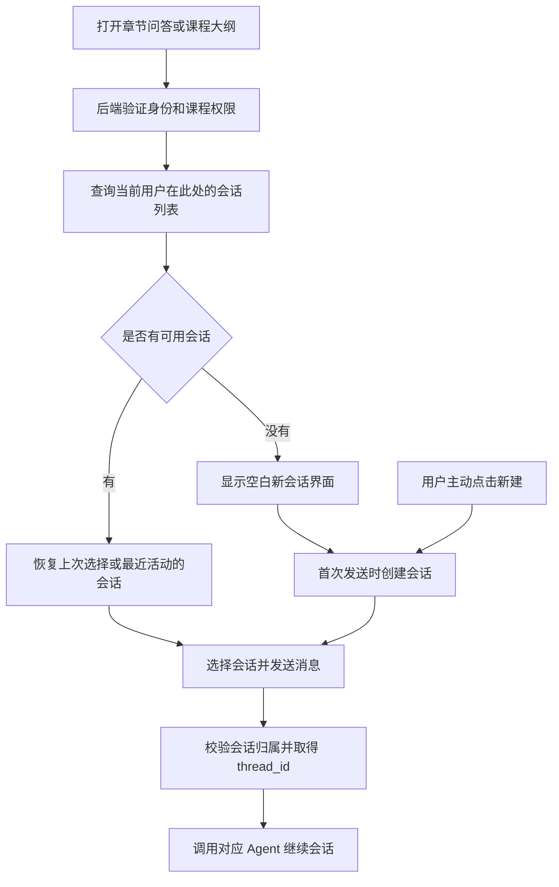
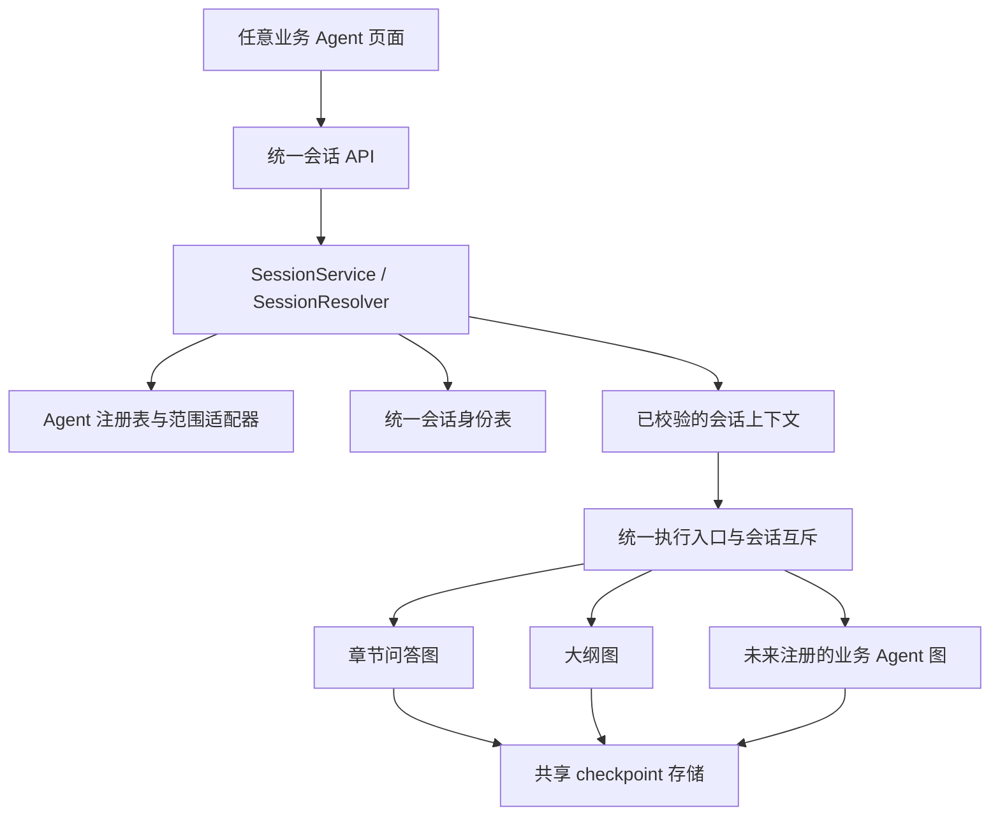

# 可扩展 Agent 隔离与统一会话管理方案

日期：2026-09-17

状态：方案已整理，实施决策已于 2026-09-17 拍板（见第 12 节），并据此开工。用户已确认支持创建、切换多条会话，保留旧历史，访问权限维持现状；进一步要求未来新增 Agent 复用同一套隔离机制，并统一会话定位。第 1-11 节仍为方案原文；第 12 节是实施时生效的决策记录。

核心设计：由后端统一维护“用户—Agent—业务范围—会话—thread_id”的对应关系。当前业务范围是课程、章节；新增 Agent 可复用已有范围，或注册新的业务范围。业务会话记录负责身份、归属与生命周期，LangGraph checkpoint 继续负责消息历史和执行恢复状态。

统一管理的是会话定位、身份校验、生命周期和持久化边界；Agent 的执行图、业务权限细则及上下文构造通过注册的适配器扩展。

## 1. 当前业务与问题

| 业务     | 使用者与范围                                 | 当前会话定位                                                              | 当前限制                                                                                   |
| -------- | -------------------------------------------- | ------------------------------------------------------------------------- | ------------------------------------------------------------------------------------------ |
| 章节问答 | 用户在有访问权的章节提问，学生页面为主要入口 | 前端按 user + chapter 查最近的 ChatSession，无则另外创建；id 即 thread_id | 找与建不是一个原子操作；agent 类型没有落到会话身份记录；每范围一条只是页面行为             |
| 教学大纲 | 教师针对有管理权的课程生成、修改大纲         | 浏览器按 user + course 保存 UUID；后端构造 outline:user:UUID              | 没有服务端课程会话映射；不同设备无法仅按课程找回线程；同一教师复用 UUID 可混用不同课程历史 |

两个 Agent 是独立业务助手，都需要跨请求保留对话；当前没有相互委派的主管/子 Agent 业务。

代码入口：

- `frontend/src/components/Courses/AskPanel.tsx`
- `frontend/src/components/Courses/OutlinePanel.tsx`
- `backend/app/models.py` 的 `ChatSession`
- `backend/app/services/chat_sessions.py`
- `backend/app/api/routes/chat.py`、`outline.py`、`courses.py`
- `backend/app/core/langgraph/graph.py`、`outline.py`、`checkpoint.py`

## 2. 已确认的业务规则

| 场景         | 会话归属               | 目标行为                             |
| ------------ | ---------------------- | ------------------------------------ |
| 学生章节问答 | 用户＋章节＋问答 Agent | 可以创建多条会话，切换后继续对应历史 |
| 教师课程大纲 | 用户＋课程＋大纲 Agent | 可以创建多条会话，切换后继续对应历史 |

共同规则：

- “新建会话／重新开始”创建一条空会话，旧会话和历史保留，并可切回继续。
- 不同会话默认不共享聊天历史，包括同一用户在同一课程下的不同会话。
- 不同设备可以通过后端会话列表找回历史。
- 学生问答权限维持现状：本人可访问，超级管理员保留访问例外，普通教师不能查看。
- 大纲维持教师个人会话，不新增跨教师共享历史功能，也不因统一会话表自动扩大管理员在大纲业务中的访问范围。
- 保留历史不等于自动复制历史；新会话不继承旧会话的消息、待恢复任务或中断状态。
- 新 Agent 通过注册接入同一会话基础设施，不另建一套找线程、生成线程 ID、读历史和删历史的规则。

以上是用户确认的需求。下面的数据模型、接口分工及边界处理属于本方案的技术建议，不表示已经实现。

## 3. 统一会话身份模型

新增统一业务会话模型，供现有及未来 Agent 共用。它负责“这是谁的、哪个助手的、属于哪个业务范围”；消息与图状态继续保存在 checkpoint 中，不新增重复的消息主存储。

| 字段                           | 作用与约束                                                                                                                              |
| ------------------------------ | --------------------------------------------------------------------------------------------------------------------------------------- |
| `session_id`                 | 前端使用的会话标识，由后端创建                                                                                                          |
| `thread_id`                  | 后端定位 LangGraph 状态，唯一且创建后保持不变                                                                                           |
| `user_id`                    | 会话所有者，由后端认证身份确定                                                                                                          |
| `agent_key`                  | 稳定的 Agent 标识；当前注册`chat`、`outline`，以后通过注册增加，不使用写死两个值的数据库枚举                                        |
| `scope_type`                 | 业务范围类型；当前为`chapter`、`course`，旧普通聊天使用受控的 `user` 范围                                                         |
| `scope_id`                   | 业务对象的规范化标识；当前课程/章节为对应 UUID，`user` 范围由后端绑定本人 ID。以字符串列存储（决策 12.1），规范化规则由范围适配器定义 |
| `title`                      | 会话列表名称，可使用默认名称并允许手动修改                                                                                              |
| `created_at`、`updated_at` | 创建时间和最近活动时间，用于列表排序                                                                                                    |
| `status`                     | 正常、删除中等生命周期状态                                                                                                              |
| `state_version`              | 本会话采用的图状态格式版本，用于后续 Agent 升级的兼容检查，与显示名称无关                                                               |

约束：

- 不对“用户＋Agent＋scope_type＋scope_id”设置单会话唯一约束，因为同一范围允许多条会话；该组合与状态、活动时间可建列表查询索引。
- `thread_id` 自身必须唯一。不得让两个独立业务会话引用同一个线程。
- `session_id` 与 `thread_id` 分开保存，便于兼容旧聊天 UUID 和旧大纲带前缀的线程格式；前端只操作 `session_id`。
- 会话的所有者、Agent 和业务绑定在创建后不可通过改名等普通接口修改。
- checkpoint 为空是新会话或已清空会话的合法状态，不能据此更换 `thread_id`。

### 3.1 当前业务如何映射到通用范围

| Agent                  | `agent_key`     | `scope_type` | `scope_id`    | 服务端推导的上下文                     |
| ---------------------- | ----------------- | -------------- | --------------- | -------------------------------------- |
| 章节问答               | `chat`          | `chapter`    | 章节 UUID       | 章节、所属课程、当前选课/管理权限      |
| 教学大纲               | `outline`       | `course`     | 课程 UUID       | 课程、所属教师、章节列表               |
| 旧普通聊天兼容         | `chat`          | `user`       | 会话所有者 UUID | 个人范围，无课程上下文                 |
| 未来作业辅导（仅示例） | `homework_help` | `assignment` | 作业标识        | 由未来业务适配器定义，本轮不建设此功能 |

课程/章节不再是通用会话表必须不断追加的专用列，而是业务范围的两个实例。章节所属课程由后端查询推导，不接受前端另传一个课程 ID 来覆盖。若为查询性能保留派生列，它也不能成为独立的权限依据。

通用范围会失去“单个外键直接指向不同业务表”的便利：因此每个范围类型必须注册规范化、对象加载和删除联动规则；创建和每次访问都重新校验对象。不得只把类型和 ID 当作不受约束的 JSON，也不能因为省掉专用列而省掉资源存在性与权限检查。尚未注册的范围类型一律拒绝。

### 3.2 定位范围与具体会话分开

```text
列表/选择范围 = (认证 user_id, agent_key, scope_type, scope_id)
具体会话     = session_id
持久化地址   = 已校验会话记录中的 thread_id
```

前一个组合可能对应多条会话，不能作为唯一线程键。`session_id` 用来选择其中一条；`thread_id` 只在后端作为存储地址使用，不反向解析它来决定权限或业务范围。

新线程由统一服务生成不透明的唯一标识。旧线程即使保留带前缀格式，也通过记录映射使用，不让 Agent 或前端各自拼接线程 ID。

## 4. 前后端请求流程

多会话场景下，“恢复已有会话”与“主动创建新会话”必须分开。所有页面复用统一的 SessionService（会话服务）与 SessionResolver（会话定位器），由定位器集中完成身份、Agent、范围和会话选择校验；两者可以是同一模块的职责划分，不要求建设两个服务进程。



### 4.1 对外操作

接口职责按下表划分：

| 操作          | 后端行为                                                     | 前端行为                                                       |
| ------------- | ------------------------------------------------------------ | -------------------------------------------------------------- |
| 打开页面      | 验证用户与业务权限，查询此范围内可见的会话列表               | 恢复仍有效的本地选择，否则选择最近活动会话；无会话则显示空界面 |
| 首次发送      | 无会话时先创建并保存会话身份，返回标识；再进入消息发送流程   | 保存返回的`session_id`，不自己生成 `thread_id`             |
| 主动新建      | 创建新的会话身份与线程映射，不复制或删除旧历史               | 切换到新会话                                                   |
| 切换会话      | 校验归属，读取该线程历史                                     | 展示目标会话历史                                               |
| 发送/流式发送 | 根据已校验会话构造业务上下文与 LangGraph 配置                | 只提交新消息；完成后重新读取服务端历史                         |
| 修改标题      | 校验会话权限，仅更新标题                                     | 刷新列表名称                                                   |
| 删除会话      | 独立于“新建”执行，校验权限并协调运行状态与 checkpoint 清理 | 仅在明确删除操作时移除对应会话                                 |

约定：

- 查询列表不产生创建副作用，不因刷新页面创建大量空会话。
- “创建并保存会话身份”必须成功后，才能向 Agent 发送消息。
- 传入无效或无权访问的会话 ID 时返回错误，不偷偷创建另一条并重发消息。
- `thread_id`、系统提示词与可信业务上下文由后端决定；前端只提交目标会话和用户消息。
- 新建会话失败时旧会话仍然保留，不先清旧历史。

### 4.2 统一的定位输入、输出与行为

前端首次进入页面只描述“要在哪个助手、哪个业务对象下工作”，例如：

```json
{
  "agent_key": "chat",
  "scope": { "type": "chapter", "id": "章节 UUID" },
  "preferred_session_id": "可选的上次选择"
}
```

用户 ID 不由前端指定。Agent 和范围也是待验证输入：后端必须查注册表、规范化标识并加载真实业务对象。

统一定位器按以下顺序工作：

1. 从认证上下文取得调用者，查找 Agent 注册项和允许的范围类型。
2. 通过范围适配器加载对象，并执行 Agent 对当前操作的业务权限规则。
3. 若指定 `preferred_session_id` 或要操作具体 `session_id`，校验该记录的访问权限及 Agent、范围是否精确匹配；不匹配返回统一不可用结果，不自动改用别的会话。
4. 若未指定会话，只在当前用户＋Agent＋范围中选择最近活动会话；排序使用活动时间及会话 ID 作稳定次序。没有会话返回空选择，不创建。
5. 新建只能走显式创建入口；首次发送的前端流程也调用该入口，并带新建幂等标识。
6. 对发送、恢复等运行操作，返回内部的 `ResolvedSessionContext`，统一执行层据此调用 Agent。

内部结果至少包含：调用者、会话所有者、`session_id`、`thread_id`、`agent_key`、规范化范围、加载的业务资源、当前操作与状态版本。调用者与所有者分开记录，避免管理员访问他人聊天时把历史或上下文归给管理员。

该结果只在服务端当前操作内构造，不作为前端可回传的授权凭证，不长时间缓存已通过的权限。涉及图运行时，在取得会话互斥后重新核对会话状态与关键权限，再读取 checkpoint。

对外返回会话标识、标题、范围和必要状态，不需要返回底层 `thread_id`、系统提示词或资源内部对象。未知/未授权的具体会话返回相同的不可用错误，不能借定位接口枚举他人会话。

### 4.3 统一接口与前端接入约定

建议接口形状如下，仅为方案约定：

| 接口                                                           | 用途                                                   |
| -------------------------------------------------------------- | ------------------------------------------------------ |
| `GET /agent-sessions?agent_key=…&scope_type=…&scope_id=…` | 列出本人在该范围的会话                                 |
| `POST /agent-sessions/resolve`                               | 根据范围与可选偏好选择已有会话，只读语义，无创建副作用 |
| `POST /agent-sessions`                                       | 显式新建会话，输入 Agent、范围和新建幂等标识           |
| `GET /agent-sessions/{session_id}`                           | 获取已鉴权会话详情                                     |
| `GET /agent-sessions/{session_id}/messages`                  | 读取对应历史                                           |
| `POST /agent-sessions/{session_id}/messages[/stream]`        | 发送新消息或流式发送                                   |
| `PATCH /agent-sessions/{session_id}`                         | 修改标题                                               |
| `DELETE /agent-sessions/{session_id}`                        | 明确删除该会话                                         |
| `POST /agent-sessions/outline/import-hints`                  | 旧大纲历史的一次性上报导入通道（见 §8.2、决策 12.7）  |

具体会话接口的运行目标从保存的记录确定，不能由请求另选执行器。页面调用同时携带期望的 `agent_key` 和 `scope` 作为一致性断言；二者必须与记录一致，不能修改记录，也不能替代身份与业务权限。历史兼容路由由适配层提供对应的期望值，再调用同一定位器。

前端抽取共享的会话管理 Hook/客户端，只需要传入 Agent 与范围。会话列表、选择、新建、恢复、缓存键与流式响应归属规则统一处理；问答与大纲页面只保留自己的展示和输入交互。新 Agent 不复制一套 localStorage 找线程逻辑。

## 5. 会话权限与业务范围隔离

所有会话操作经过统一后端会话服务，验证：

```text
认证用户
  ＋ 会话访问权限
  ＋ 当前入口对应的 Agent
  ＋ 会话绑定的课程/章节
  ＋ 当前业务访问权限
```

例如，在“章节 A 的问答助手”中提交大纲助手的会话 ID，即使所有者相同，也不能调用；同一教师不能把课程 A 的会话用于课程 B。

| 对象                            | 访问规则                                       |
| ------------------------------- | ---------------------------------------------- |
| 自己的章节问答                  | 有当前课程访问权时允许；章节与会话绑定必须一致 |
| 其他学生的章节问答              | 普通学生、普通教师拒绝；保留现有超级管理员例外 |
| 自己的大纲会话                  | 符合教师接口资格，且具有对应课程管理权限       |
| 其他教师的大纲会话              | 不新增跨教师历史访问入口，维持现状             |
| 错误 Agent、错误课程/章节的会话 | 拒绝使用，即使用户相同                         |
| 已删除或删除中的会话            | 不再允许发送、恢复或读取正常历史               |

列表、详情、历史、流式与非流式发送、改名、删除，以及以后接入的中断恢复，必须使用一致的校验逻辑。管理员例外也不能绕过 Agent 类型和业务绑定一致性检查；普通会话列表仍默认只列本人的会话。

课程、章节上下文由后端根据会话绑定读取。前端不能换一个 `course_id` 就把已有线程用于另一门课程。工具即使配置给某个 Agent，读取业务数据时仍需执行资源权限校验。

方案补充默认规则：退课后停止访问相关课程会话，保留数据；重新获得权限后可以恢复。此项属于针对权限变化的设计建议，不是已存在的后端保证。课程、章节或用户删除时，需把关联 checkpoint 清理纳入对应删除流程，不能仅依赖业务表外键级联，也不能将失去业务对象的会话退化为普通聊天继续使用。

## 6. 可扩展 Agent 注册与共享基础设施

### 6.1 注册定义，统一调度

新增 Agent 的扩展点放在服务端注册表中。初期使用代码注册即可，不要求建设动态插件平台或后台配置系统。

| 注册内容                             | 责任                                                                             |
| ------------------------------------ | -------------------------------------------------------------------------------- |
| `agent_key`                        | 稳定且唯一的业务标识，显示名称改变不改变此键                                     |
| `allowed_scope_types`              | 允许关联哪些范围，例如问答接受`chapter`，大纲接受 `course`                   |
| `access_policy`                    | 定义创建、列表、历史、发送、改名、删除、恢复等操作的权限；明确所有者和管理员例外 |
| `context_provider`                 | 用真实用户和已加载资源构造提示词所需业务上下文                                   |
| `executor`                         | 创建/获取对应编译图并执行，保留本 Agent 的提示词与工具绑定                       |
| `input_contract`、`capabilities` | 声明合法输入，以及是否支持流式、恢复等能力；不支持的操作明确拒绝                 |
| `state_version`、兼容规则          | 声明可读取和继续执行哪些版本的历史状态                                           |

通用服务必须先执行基础隔离检查：会话状态、Agent/范围精确匹配、所有者规则、资源有效性；注册策略仅承载明确的业务差异。新 Agent 默认仅本人访问，管理员例外必须显式声明，不自动继承聊天 Agent 的例外。

范围适配器与 Agent 注册分开：`chapter` 适配器负责规范化章节 ID、加载章节及所属课程，多个基于章节的 Agent 可以复用；不同 Agent 再声明对该资源需要读取权还是管理权，以及哪些内容可以进入上下文。新增 Agent 使用现有范围时，不需要增加会话表字段；新增业务类型时，增加范围适配器和相应权限规则。



每个图只取得当前会话允许的状态与上下文。统一执行入口负责构造 LangGraph 配置，不允许 Agent 注册项在业务请求中另找线程、替换会话所有者或覆盖当前 `thread_id`。这是一套受信任服务端代码的约束，不构成对任意恶意插件代码的沙箱。

### 6.2 共享与独立的边界

本方案允许保留现有两个 Agent 的图、LLM 服务实例和连接池，优先统一会话管理，不要求同时重构连接池。

| 内容                                        | 处理方式                                                          |
| ------------------------------------------- | ----------------------------------------------------------------- |
| PostgreSQL 与 checkpoint 表                 | 继续共享                                                          |
| 会话查询、权限校验、新建逻辑                | 统一服务管理，业务差异由注册策略提供                              |
| 编译图、提示词、工具列表、可变 LLM 服务状态 | 各 Agent 独立                                                     |
| 消息历史与执行恢复状态                      | 通过业务会话映射的唯一`thread_id` 分开                          |
| 用户与业务上下文                            | 每次请求从认证结果和业务范围构造，资源解析与 Agent 上下文构造分开 |
| 未来长期记忆                                | 另行定义共享范围，不能默认跨会话共享                              |

Agent 调用入口接收后端已经校验的会话上下文，不直接透传客户端线程字符串。共享模型配置、连接或工具执行代码，不意味着共享业务权限或对话历史。

`checkpoint_ns` 不作为业务用户鉴权的替代。若未来增加真正的协作子 Agent，应另外设计父子图之间允许传递的状态，本轮不引入主管调度或子 Agent 编排。

本方案提供应用层逻辑隔离，不承诺进程、数据库账户、算力配额或故障影响的完全隔离。

### 6.3 新 Agent 接入步骤

1. 实现本 Agent 的执行图、提示词和工具集合。
2. 注册唯一 `agent_key`、支持范围、权限策略、输入契约与上下文构造器。
3. 若现有范围可复用，直接使用；若是新业务资源，增加范围适配器及删除/权限变化的联动规则。
4. 页面向共享会话组件传入该 Agent 与业务范围，复用列表、新建、切换和发送接口。
5. 运行统一隔离契约测试，并补充该 Agent 特有权限与上下文用例。

接入后的新 Agent 自动复用会话身份映射、幂等创建、历史定位、会话互斥和缓存维度；业务资源的权限语义及工具正确性仍需具体实现，不能仅填一个名字就声称隔离完成。

### 6.4 注册与版本边界

- 注册表启动时检查重复键、缺失的范围/权限适配器、状态版本声明；未知 Agent 不回退到聊天 Agent。
- `agent_key` 一旦被历史会话引用，不得重新赋给另一个业务 Agent。显示名、模型或提示词调整不靠改键完成。
- 停用 Agent 时拒绝新建和新运行。旧历史是否可读由显式的保留策略控制；需要保留可读时仍保留其权限与历史读取适配器，不能因执行器缺失绕过鉴权。
- 图状态不兼容升级时，已有会话不能直接交给不兼容图恢复。保留兼容版本，或单独规划状态迁移；迁移完成前原历史保留、新对话使用新版本。
- 未来会话若需跨 Agent 协作或跨用户共享，必须增加显式业务机制；不通过复用独立会话的 `thread_id` 实现。

## 7. 并发、重试与前端缓存

### 7.1 重复创建

一次新建操作携带幂等标识，统一服务在“用户＋agent_key＋scope_type＋scope_id”内处理，并校验同一标识的请求参数一致性。网络重试返回同一条会话；用户再次主动新建使用新的标识。不得以“同一用户同一章节已有会话”为由阻止正常的新建。

创建已成功但消息发送失败时，保留已创建会话供后续继续，不再创建重复会话。

### 7.2 同一会话并发运行

后端按会话做互斥，同一会话已有回复生成时，第二个发送或恢复请求提示“该会话正在回复”；不同会话可以并行。互斥需覆盖多个后端进程，不能仅依赖页面按钮禁用或进程内锁。

互斥覆盖状态读取、图执行和本轮 checkpoint 写入完成的生命周期；正常、异常、取消都必须释放。删除或兼容清空操作与发送使用同一互斥边界，避免删除后旧运行又写回历史。

实施决策（12.4）：互斥用会话表上的租约列实现（`run_token`、`run_expires_at`），以条件 UPDATE 获取（仅当无租约或租约已过期时可获取），流式生成期间周期性心跳续期，正常、异常、取消在 finally 中统一释放；持有进程崩溃后租约至多在 TTL 后过期，会话自动可再次使用。不采用 advisory lock：部署实际为多 worker 进程（Dockerfile `--workers 4`），且流式回复以分钟计，独占池连接会与 `CHECKPOINT_POOL_SIZE` 相互挤压；租约不占用任何长连接。

### 7.3 切换会话与流式结果

每个流式请求绑定发起时的用户、会话 ID 和请求标识。切换到 B 后，A 的迟到 token、完成回调或失败回滚不得修改 B 的显示。

前端在切换会话或账号时清理当前显示状态、取消相应订阅，并校验回调是否仍属于当前会话。浏览器取消不等于后端一定已停止；后端在真实运行结束前仍保持互斥。重新打开 A 时，以服务端历史为准。

### 7.4 缓存与跨设备恢复

列表、历史和本地选择按以下维度区分：

```text
会话列表：用户 ID＋agent_key＋scope_type＋scope_id
历史内容：用户 ID＋agent_key＋scope_type＋scope_id＋session_id
本地选择：用户 ID＋agent_key＋scope_type＋scope_id → session_id
```

本地存储只负责记住选择，后端会话记录才是归属依据。换设备时通过后端列表恢复；不要求本轮同步各设备最后选中的会话。遇到失效选择先刷新列表，不自动提交原消息。流中断后重新读取服务器历史，不自动重复提交可能已经执行的用户消息。

## 8. 现有数据兼容

### 8.1 现有聊天历史

- 将 `ChatSession` 的用户、章节、名称迁入统一会话模型：章节会话映射为 `chat + chapter + chapter_id`，旧普通聊天映射为 `chat + user + owner_id`。
- 保留原 `thread_id`，避免重写 checkpoint；迁移映射精确为 `session_id = 旧 ChatSession.id`、`thread_id = str(旧 id)`（决策 12.2），旧前端与旧路由在过渡期无感。
- 旧表退役路径（决策 12.9）：迁移 revision 建新表并搬数据 → 旧 `/chat/*` 路由立即委托统一会话服务（旧 id 即新 `session_id`，直通）→ 旧 `ChatSession` 表冻结只读、仅作回滚参考 → 验收通过后的独立 revision 删除旧表。并存期间仅新表可写。旧 `/outline/threads/*` 路由不委托：其唯一客户端（OutlinePanel）随本方案改版直接切换到统一接口，“清空并重新开始”入口改为新建会话，旧路由随前端切换删除。
- 已有多条聊天会话全部保留，在列表中展示。
- 未绑定章节的普通聊天保留为兼容类型，不强行归入某个章节，也不扩展新的通用聊天业务入口。
- 旧 API 如需过渡，委托统一会话服务执行同样的权限检查，不保留绕过新规则的调用路径。

### 8.2 现有大纲历史

- 保留 `outline:{user_id}:{uuid}` 格式的旧线程，不因表结构统一而删除或重写历史。
- 可确认课程的会话映射为 `outline + course + course_id`；统一定位依赖新会话记录，不依赖旧前缀反向解析。
- 可核对旧线程用户归属，但仅凭 UUID 无法可靠确定课程归属。
- 浏览器映射的采集机制（决策 12.7）：产品内一次性上报。新版 OutlinePanel 首次加载时，把 localStorage 中该用户的全部 `outline-thread:{userId}:{courseId}` 键值对 POST 到 `POST /agent-sessions/outline/import-hints`；已上报过的 uuid 在本地标记，不重复上报。后端逐条验证：教师身份与课程所有权、线程前缀归属（`outline:{userId}:`）、checkpoint 行非空（决策 12.8：空线程一律不导入——现行前端会为每门课预生成从未使用的 uuid）、未被其他课程重复绑定。全部通过的导入为 `outline + course` 会话（`thread_id` 保持 `outline:{userId}:{uuid}` 原值）。
- 验证不通过的线程不导入、checkpoint 原样保留，即“待归类旧历史”：它们不出现在任何会话列表中，但绝不删除；将来若需要可另做显式归类工具。不用模型分析对话文本猜测课程归属。
- 浏览器映射不能证明旧线程从未被用于其他课程。有混用迹象或归属无法核实的历史，保留为“待归类旧历史”，不直接绑定某课程继续生成；课程内另建干净会话。
- 不用模型分析对话文本猜测课程归属；无法恢复的绑定关系明确标注，原历史保留。
- 旧大纲的“清空并重新开始”入口改为新建会话，旧历史留在列表。

## 9. 参考实现与适用边界

以下是本次对话核实的上游源码参考，链接指向 `main`，可能继续变化。实现前应固定参考提交；不能把当前主分支全部视为稳定版本功能。

### LibreChat：共享运行基础设施，分别校验资源权限

参考其会话用户权限、Agent 资源权限和 checkpoint 适配分层。其 saver 可复用进程内实例和应用已有 MongoDB 连接；相关 checkpoint 逻辑偏向运行恢复，不能直接照搬到本项目“checkpoint 是消息历史唯一存储”的生命周期中。

- [会话权限](https://github.com/danny-avila/LibreChat/blob/main/api/server/middleware/validate/convoAccess.js)
- [Agent 初始化与资源权限](https://github.com/danny-avila/LibreChat/blob/main/api/server/services/Endpoints/agents/initialize.js)
- [共享 saver 与 checkpoint 适配](https://github.com/danny-avila/LibreChat/blob/main/packages/api/src/agents/checkpointer.ts)

### Dify：会话查询包含应用与用户归属

参考 `get_conversation` 同时限定会话、应用、来源和用户，而不是拿 ID 直接读历史。对应本业务需同时校验用户、问答/大纲 Agent 和业务对象。Dify 不作为 LangGraph checkpoint 实现来源。

- [ConversationService](https://github.com/langgenius/dify/blob/main/api/services/conversation_service.py)

### DeerFlow：一次性子 Agent 的执行边界

其回归测试要求特定一次性子 Agent 创建时禁用 checkpoint 继承。此策略不适用于本项目两个需要持续历史的独立业务助手，仅作为未来协作子 Agent 的对照。

- [子 Agent checkpoint 隔离测试](https://github.com/bytedance/deer-flow/blob/main/backend/tests/test_subagent_checkpointer_isolation.py)

## 10. 后续实施顺序（仅计划）

1. 定义 Agent 注册契约、业务范围适配器、统一会话模型和 SessionResolver；用当前问答、大纲验证两类业务可复用。
2. 制定旧 ChatSession、大纲线程的映射与兼容迁移，保留历史。
3. 接入会话列表、新建、详情、历史、发送、改名与删除的统一校验路径。
4. 提供共享会话 Hook/客户端，在两个面板增加多会话列表和切换，替换旧前端找建与大纲清空逻辑。
5. 完成幂等、同会话互斥、流式回调和缓存隔离。
6. 按下列验收标准验证，再停用旧的绕行接口。

实施落点（2026-09-17，步骤 1-6 均已完成并通过验证）：

- 注册表与范围适配器：`backend/app/services/agent_registry.py`；会话服务与定位器、租约：`backend/app/services/agent_sessions.py`；课程访问检查下沉：`backend/app/services/course_access.py`。
- 统一接口：`backend/app/api/routes/agent_sessions.py`；旧 `/chat/*` 路由委托同套服务（`chat.py`），旧 `/outline/threads/*` 路由已删除。
- 迁移：alembic `a9c3e7f10d24`（建 `agentsession` 表、三个索引、存量 ChatSession 数据搬迁；旧表冻结待验收后删除）。旧大纲历史走产品内 `import-hints` 一次性上报。
- 前端：`frontend/src/hooks/useAgentSessions.ts`（共享会话 Hook）、`components/AgentSessions/SessionBar.tsx`（切换/新建/改名/删除），AskPanel 与 OutlinePanel 已切换并接入旧线程上报。
- 清理钩子：课程/章节/用户删除流程显式清理会话与 checkpoint（`courses.py`、`users.py`）。
- 验证：`backend/tests/api/routes/test_agent_sessions.py`（权限矩阵/幂等/租约/断言/导入/清理）+ 委托化后的 `test_chat.py`；真栈验收 `backend/scripts/verify_agent_sessions.py`（含一次真实 LLM 回合、第三个测试 Agent 注册、跨 Agent 404）。

## 11. 验收标准

1. 同一章节或课程可以创建、列出、切换多条会话。
2. 新会话不会带入旧会话历史或恢复任务；切回旧会话可以继续。
3. 不能通过替换 ID 访问其他用户、Agent 或课程的会话。
4. 列表、历史、发送、流式、改名、删除和恢复使用一致权限规则。
5. 普通教师仍不能读取学生问答；管理员例外不扩大为任意 Agent/业务绑定绕过。
6. 刷新、换设备、网络重试不会导致历史丢失或重复建会话。
7. 两个标签页、两个后端进程同时操作同一会话，不会并发改写图状态。
8. 切换会话或账号时，流式内容、失败回滚和缓存不会串到另一条会话。
9. 旧聊天历史继续可读；旧大纲历史有可解释的导入或待归类路径，不静默删除。
10. 失去课程权限后已有会话不能绕过权限继续读写；父对象删除不留下可调用的孤立会话。
11. 新建、失败、取消、删除与空 checkpoint 等边界有明确行为，不把“没有历史”误判为“没有会话”。
12. 使用测试 Agent 注册第三个助手，复用章节范围时无需修改通用会话表或复制定位/历史/删除逻辑；其历史与前两个 Agent 分开。
13. 注册新的测试范围类型后，通用定位、列表与缓存仍可工作；缺少资源适配或权限规则的类型拒绝接入。
14. 相同用户、相同对象 ID 在不同 `scope_type` 或 `agent_key` 下不串会话；未知、重复或停用 Agent 不会回退到其他图执行。
15. 指定错误偏好会话时不偷偷切换会话并发送；未指定会话且范围为空时不自动创建。
16. 统一定位正确区分调用者与会话所有者；管理员例外、Agent 状态版本不兼容和图恢复遵循各自明确规则。

## 12. 实施决策记录（2026-09-17 拍板）

以下决策在实施时生效，是对第 1-11 节留白处的明确化；与前文冲突时以本节为准。

1. **`scope_id` 列类型**：字符串列。当前所有范围标识均为 UUID，适配器统一规范化为小写字符串；未来非 UUID 标识（如整数主键）使用同一列，不改表。
2. **迁移映射**：旧问答会话 `session_id = 旧 ChatSession.id`、`thread_id = str(旧 id)`，两值相同，旧客户端无感。新会话 `session_id` 为新 UUID，`thread_id` 由统一服务生成为 `sess:{uuid4}` 格式（决策 12.10），不含用户或业务信息。
3. **幂等键**：`agent_session.idempotency_key` 可空列，`(user_id, agent_key, scope_type, scope_id, idempotency_key)` 上建唯一索引（NULL 不参与唯一性，手动新建可不带键）。同键同参重试返回既有会话；同键不同参返回 409。无 TTL 清理：键随会话行存活，会话删除后同键可再次使用。
4. **同会话互斥**：会话表租约列 `run_token`（随机 token）＋ `run_expires_at`。获取用单条条件 UPDATE（`WHERE id = ? AND (run_token IS NULL OR run_expires_at < now())`），TTL 120 秒，流式期间每 30 秒心跳续期；正常、异常、取消统一在 finally 释放（条件 DELETE 自己的 token）。进程崩溃后至多 TTL 即自动恢复可用。不使用 advisory lock（理由见 §7.2）。删除会话先取同一租约。
5. **HTTP 状态码语义**：`409`＝会话正在回复（租约被占）或幂等键参数冲突；`404`＝会话不存在或无权访问，二者不可区分；`403`＝业务权限不足（未选课、非教师、非课程所有者）；`422`＝输入契约错误。大纲会话对其他教师（含超级管理员）一律 404——维持“无跨教师入口”的现状，管理员例外仅适用于问答 Agent。
6. **会话标题**：创建时为空字符串；首次成功回合结束后，若标题仍为空，取首条用户消息前 24 个字符作为标题（确定性截断，不调用 LLM）。原 vendor 模板的 LLM 自动命名不做。手动改名走 PATCH。
7. **旧大纲历史采集**：产品内一次性上报（`POST /agent-sessions/outline/import-hints`），详见 §8.2。
8. **空线程不导入**：无 checkpoint 行的旧 uuid 一律不导入，不产生空会话记录。
9. **旧表退役**：详见 §8.1 第 3 条。回滚策略：迁移 revision 仅新增表和数据、不删旧表旧路由，出问题可直接回退应用版本（新表数据无害残留）；旧表删除放在验收之后的独立 revision。
10. **新线程格式**：`sess:{uuid4}`。前缀仅为可读性，不承载任何身份或业务语义；身份只在会话记录中。
11. **删除顺序**：先清 checkpoint 行、再删身份行（沿现状）；中途崩溃残留的“空会话”是合法状态，可再次删除。课程、章节、用户删除流程显式清理关联会话与 checkpoint——新表 `scope_id` 为通用字符串列无外键级联，必须显式清理；旧 `ChatSession` 表的外键级联仅作旧身份行的兜底。
12. **`updated_at` 维护**：发送回合完成（流式与非流式一致）、改名时更新；列表排序 `updated_at DESC, id` 作稳定次序。
13. **Agent 注册与范围适配器落点**：`app/services/agent_registry.py`（注册表＋范围适配器）、`app/services/agent_sessions.py`（会话服务＋定位器＋租约）、`app/api/routes/agent_sessions.py`（统一接口）。执行器复用两个 agent 现有实例方法，不包一层新的运行时。

### 12.1 评审修订（2026-09-18，8 项发现全部核实属实后修复）

1. **租约覆盖所有发送入口（修订 12.4）**：非流式发送原本无续期，生成超过 TTL 后第二个请求可进入同线程。新增统一运行器 `run_exclusive`（非流式）与 `stream_exclusive`（流式，生产者任务＋队列）：全程心跳续期；**续期失败即取消执行任务**并抛 `LeaseLostError`（HTTP 409），不再只记录日志放任旧运行继续写历史。旧 `/chat/*` 委托路由同样接入。
2. **删除不再写 `deleting` 中间态（修订 12.11）**：原先"先提交 `status='deleting'` 再清 checkpoint"，清理失败会让会话卡在非 active 状态、连重删都被拒。现改为租约互斥下直接"清 checkpoint → 删身份行"，中途崩溃残留的是可重删的合法空会话。`status` 列保留作未来软删除。
3. **管理员删除用户接入清理（补充 §5/§12.11）**：`DELETE /users/{user_id}` 与 `/users/me` 复用同一 `purge_user_sessions`，消除 checkpoint 孤儿。
4. **`state_version` 接线（落实 §3/§6.4）**：创建会话时写入 `spec.state_version`；发送/流式入口执行 `ensure_state_compatible`——版本不匹配拒绝继续生成（409），历史读取不受限（保留策略另行定义）。
5. **前端选择模型重做**：选中/新建的会话 ID 即时生效（不再等待列表刷新，杜绝"新建后消息发进旧会话"）；创建进行中禁用输入。存储的偏好改由 `POST /resolve` 服务端校验（404 即丢弃偏好回退最近会话），会话超出列表第一页也能正确定位，"未加载"不再被误判为"不存在"。
6. **面板显示绑定会话**：切换会话立即清空上一会话的显示，加载中/失败不再残留旧内容。
7. **旧大纲导入前端不去重**：同一 uuid 对应多门课程时全量上报，由后端歧义检查判定为待归类（原先前端去重使该检查失效）。
8. **导入上报无本地标记**：每次挂载上报、后端按 thread_id 幂等去重（原先"失败也标记已上报"曾导致历史永久孤儿）。
