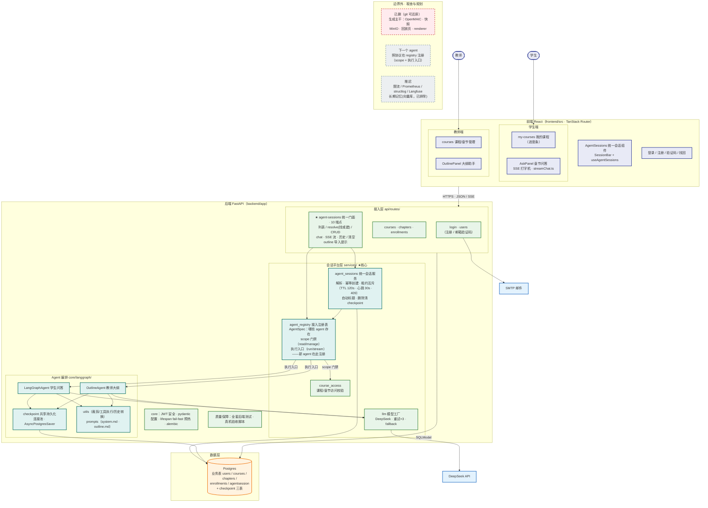

# 系统整体架构图

> 2026-09-18 更新（二）：前端全面迁入统一会话（多会话面板 + SessionBar，commit 667ac59）后，旧壳拔除——legacy `/chat` 9 端点、`/ask` 路由、`chat_sessions` 服务、冻结的 `chatsession` 表全部删除（迁移 `c41db8a7f5e3`）。
> 2026-09-18 更新（一）：统一 Agent 会话层落地（`agent_registry` 注册表 + `agent_sessions` 会话服务 + `/agent-sessions` 10 端点），outline 专属路由并入统一层。
> 2026-09-17：课件生成主干（OpenMAIC/快照/MinIO/回放/renderer）已整体删除，完整旧架构见 git 历史（main 分支）。
> 配色语言：绿=已建成并验收、蓝=外部服务、橙=存储、蓝紫=前端、灰虚线=推迟/规划、红虚线=已删。

## 读图：现在的两条主流程

1. **问答流（学生）**：AskPanel → `POST /agent-sessions` 或 `/resolve`（按 agent+章节找或建会话）→ registry 校验 scope（学生对课程 read）→ 会话服务发**租约**（同会话并发互斥，忙则 409）→ LangGraphAgent 执行（章节上下文注入中文助教模板 → 模型工厂调 DeepSeek）→ 每步落 checkpoint 三表 → SSE 逐 token 回前端。
2. **大纲流（教师）**：OutlinePanel → 同一 `/agent-sessions` 门面 → registry 校验 scope（教师对课程 **manage**）→ OutlineAgent（带私有工具）→ 同一套 checkpoint/模型工厂 → 流式返回。注意两条流**共用同一门面和同一会话服务**——这就是"平台"落地的形态。

## 平台层的三个新部件（09-18）

| 部件 | 职责 |
|---|---|
| `agent_registry` | **接入协议的落点**：声明"哪些 agent 存在、能绑什么业务范围（scope 门禁：read/manage）、怎么执行（run/stream 入口）"。新 agent 在此注册，而不是自己长出一套会话/线程/历史规则。刻意的非目标：不做插件加载、不做沙箱——只约束可信的第一方代码 |
| `agent_sessions` | 会话的唯一权威：解析归属（404=不存在/不是你的/绑定不符）、幂等创建、**租约互斥**（多 worker 下同会话同时只跑一个，TTL 120s/心跳 30s，租约丢失即中止写入）、自动标题、删除时清 checkpoint |
| `course_access` | 从 courses.py 抽出的课程/章节访问校验，供注册表与各路由复用 |

**绞杀完成（09-18 二）**：前端全面迁入统一 API 后，旧壳一次性拔除——legacy `/chat` 9 端点、`/ask` 路由、`chat_sessions` 服务、`ChatSession` 模型族、冻结的 `chatsession` 表（迁移 `c41db8a7f5e3`）全部删除；`streamChat` 的旧默认端点改为必传参数。接入层现在只剩一个面向所有 agent 的门面。

## 边界外（讲解时的取舍证据）

- **已删**：生成主干（git main 可还原）
- **下一个 agent**：照协议在 registry 注册即可——scope 声明 + 执行入口，两条路由零改动
- **推迟**：限流/监控/结构化日志/Langfuse（部署前）；向量库长期记忆（已明确排除）
