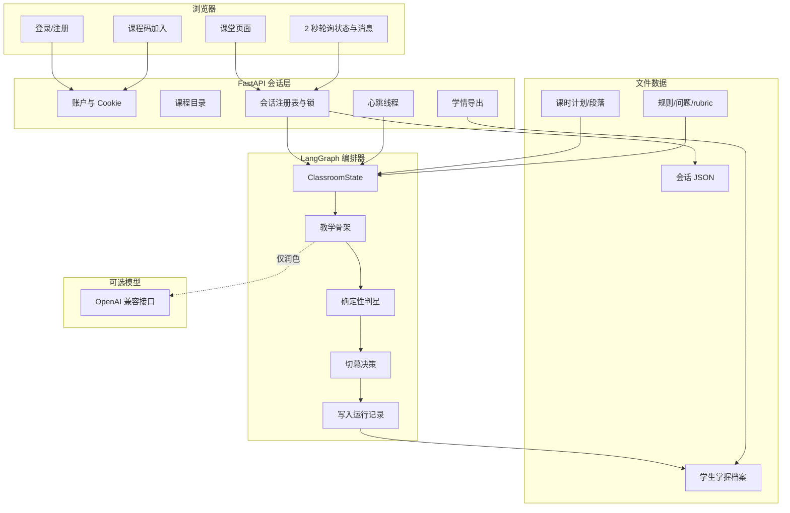
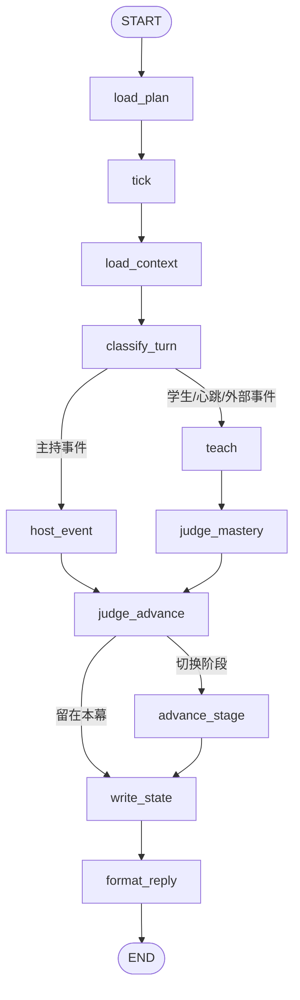

# 主动引导智能体——项目介绍（极其详细版）

> 本文面向项目汇报、答辩、代码讲解和后续维护。内容以当前仓库代码为准，并明确区分“已经实现”“设计规则”和“尚待完善”。

## 目录

1. 项目定位与核心价值
2. 技术栈与目录结构
3. 总体架构与职责边界
4. 核心领域模型
5. 一节课的完整生命周期
6. LangGraph 编排器逐节点说明
7. 阶段推进算法
8. 教学内容与问题队列
9. 掌握度、证据与快照
10. 大模型接入与降级
11. FastAPI 会话层
12. 学生账号、课程码与课程目录
13. Next.js 学生端
14. 数据存储与恢复
15. 主要 API
16. 配置一节新课
17. 启动、测试与演示
18. 安全性、并发性与可靠性
19. 当前限制与改进路线
20. 汇报话术与常见问题

---

## 1. 项目定位与核心价值

### 1.1 项目是什么

“主动引导智能体”是一个课程计划驱动的课堂引擎。它把一节课建模为一组有顺序、有时间预算、有教学目标的阶段，并在课堂运行过程中根据三类输入自动做出动作：

- 时间输入：当前时间、阶段已用时间、全课已用时间；
- 学习证据：学生回答是否覆盖知识点所需证据；
- 外部事件：开始上课、视频播放完成、教师强制进入下一环节。

系统输出的不是单纯文本，而是一整套课堂状态：当前阶段、当前问题、知识点星级、剩余阶段、切幕原因、可用操作和教师回复。

### 1.2 它和普通聊天机器人的区别

| 普通聊天机器人 | 本项目 |
| --- | --- |
| 用户先问，AI 再答 | 系统可以主动讲解、主动提问和主动推进 |
| 对话顺序主要由模型临场决定 | 课程计划和状态机决定教学顺序 |
| 很难保证一节课在规定时间内完成 | 每个阶段有预算、最短时长和超时策略 |
| 模型可能自由发挥或跑题 | 模型只能润色确定性代码给出的本轮指令 |
| 通常只保留聊天记录 | 同时记录知识点星级、证据、阶段快照和会话状态 |
| 模型故障时功能中断 | 模型故障时退回模板，课堂流程继续 |

### 1.3 核心设计原则

1. **提示词负责怎么说，数据负责教什么。**
2. **编排规则负责什么时候做什么，大模型不掌握流程控制权。**
3. **后端状态是课堂的唯一事实来源，前端不重复实现一套阶段判断。**
4. **证据先于评价，没有真实回答证据就不提升理解星级。**
5. **状态可持久化、流程可回放、无模型也可测试。**

---

## 2. 技术栈与目录结构

### 2.1 技术栈

| 领域 | 技术 |
| --- | --- |
| 前端 | Next.js App Router、React、原生 CSS、模块化原生 JavaScript 兼容层 |
| API | FastAPI、Pydantic |
| 服务运行 | Uvicorn |
| 编排 | LangGraph |
| 模型接入 | OpenAI 兼容的 `/chat/completions` 接口，使用 Python 标准库请求 |
| 数据存储 | JSON、Markdown、本地文件原子替换 |
| 前端测试 | ESLint、Playwright |
| 后端测试 | Python `unittest`、烟雾测试脚本 |

Python 依赖非常少：`fastapi`、`uvicorn`、`langgraph`。前端主要依赖 `next`、`react`。

### 2.2 目录结构

```text
Student-Agent/
├─ apps/
│  ├─ server.py                 FastAPI 会话服务
│  ├─ start.py                  一键启动入口
│  ├─ cli.py                    命令行课堂
│  ├─ smoke_test.py             课堂彩排
│  └─ API*.md                   API 与平台对接说明
├─ frontend/
│  ├─ src/app/                  Next.js 页面入口和全局样式
│  ├─ src/components/           登录、加入课程、应用壳
│  ├─ src/legacy/               课堂路由、API 和各阶段交互模块
│  └─ tests/e2e/                Playwright 端到端测试
├─ orchestrator/
│  ├─ agent.py                  真实 LangGraph 实现
│  ├─ graph_skeleton.py         教学用骨架
│  ├─ run_demo.py               编排器演示
│  └─ ORCHESTRATOR.md           编排规范
├─ lesson-data/
│  ├─ lesson-plan.json          内置课时计划
│  ├─ segments/                 内置课时的讲解段落
│  ├─ lessons/                  教师接口上传的新式课时（运行时产生）
│  └─ join-codes.json           课程加入码
├─ rules/
│  ├─ KNOWLEDGE-BASE.md         内置课知识点
│  ├─ dialogue/SKILL.md         对话路由规则
│  └─ interaction/              互动、判星和文件格式规则
├─ stages/
│  ├─ recap_discussion/         复述阶段题目、提示与评分规则
│  ├─ deep_inquiry/             探究阶段题目、提示与评分规则
│  └─ class_discussion/         讨论阶段题目、提示与评分规则
├─ runtime/
│  ├─ sessions/                 按会话保存完整状态（运行时产生）
│  ├─ students/                 按学生保存选课和掌握档案（运行时产生）
│  ├─ accounts.json             账户表（运行时产生）
│  └─ data/                     兼容/全局运行记录
├─ scripts/start-classroom.ps1  安装检查、前端构建、启动服务
└─ 启动课堂.bat                Windows 双击入口
```

---

## 3. 总体架构与职责边界



### 3.1 前端职责

- 收集学生输入；
- 显示后端返回的阶段和消息；
- 在视频播放完毕时报告事件；
- 轮询心跳产生的主动消息；
- 不自行计算阶段推进，不自行计算星级。

### 3.2 会话层职责

`apps/server.py` 明确只承担以下工作：

- 持有和恢复会话状态；
- 串行化同一会话的并发操作；
- 定时触发心跳；
- 暴露 HTTP API；
- 管理本地学生账户和课程加入关系；
- 导出学情。

教学判断不应写在会话层，否则同一个编排器在不同入口下可能产生不同结果。

### 3.3 编排器职责

- 加载、校验课程计划；
- 计算真实时间；
- 为当前阶段装配上下文；
- 决定讲解、提问和反馈；
- 根据证据更新掌握度；
- 判定是否切换阶段；
- 生成阶段快照并写入档案。

### 3.4 数据层职责

课程结构和运行状态不硬编码到前端：

- `lesson-data` 决定课程、阶段、段落和时长；
- `rules` 决定统一教学规则；
- `stages` 提供阶段专属题目和 rubric；
- `runtime` 保存会话、学生档案和对话记录。

---

## 4. 核心领域模型

### 4.1 三个最重要的标识

| 标识 | 含义 | 示例 |
| --- | --- | --- |
| `student_id` | 学生档案归属 | `stu-20260001` |
| `lesson_id` | 一节课的稳定主键 | `ch3-process-scheduling` |
| `session_id` | 某学生某次上课实例 | `cls-a1b2c3d4` 或前端生成值 |

同一学生可参加多个课时；同一课时可创建多个会话；掌握度按 `student_id` 跨会话累积。

### 4.2 三组状态不要混淆

1. `lesson_status`：会话生命周期，取值 `idle / running / ended`；
2. `host_phase`：教学阶段，取值 `uninitialized / intro / guided_learning / recap_discussion / deep_inquiry / class_discussion / ending`；
3. `student_status`：学生在课堂中的状态，如 `waiting / active / ended`。

例子：刚进入教室时可以是：

```json
{
  "lesson_status": "idle",
  "host_phase": "uninitialized",
  "student_status": "waiting"
}
```

点击开始上课后，课程计划被加载，状态进入 `running`，`host_phase` 从 `intro` 很快切到第一个启用阶段。

### 4.3 `ClassroomState` 的主要字段组

| 字段组 | 代表字段 | 用途 |
| --- | --- | --- |
| 身份 | `session_id`、`student_id`、`lesson_id` | 标识当前课堂 |
| 编排 | `host_phase`、`remaining_stages`、`target_phase` | 当前幕与下一幕 |
| 时钟 | `now`、`lesson_started_at`、`stage_started_at`、两个 elapsed | 真实时间推进 |
| 策略 | `advance_when`、`on_budget_exhausted`、`min_stage_minutes` | 切幕规则 |
| 教学 | `active_segment_id`、`question_queue`、`pending_question` | 当前讲解和提问 |
| 证据 | `turn_evidence`、`mastered`、`unresolved` | 当前学习证据 |
| 掌握度 | `kp_stars`、`kp_meta`、`mastery_updates` | 星级及其来源 |
| 输入 | `student_message`、`external_event`、`tick_only` | 本轮触发源 |
| 输出 | `reply_text`、`speech_kind`、`llm_used` | 返回给上层的结果 |

---

## 5. 一节课的完整生命周期

### 5.1 学生进入系统

1. `StudentLogin` 请求 `GET /api/student/session` 检查 Cookie；
2. 没有会话则显示登录/注册表单；
3. 注册成功后，后端写入账户并设置 HttpOnly Cookie；
4. 如果学生还没有课程，必须进入课程码页面；
5. 使用课程码加入课程后，才加载课堂应用本体。

这样做有一个用户体验上的好处：未登录时不会在登录页背后提前挂载旧课堂应用，也不会偷偷请求课程和会话接口。

### 5.2 课程目录与课时

`GET /api/student/courses` 扫描全部可用课时，并按 `course_id` 分组。课程目录由课时定义反推，没有独立数据库课程表。

当前后端把已发现的课时状态返回为 `current`，并为每门课程附带 `joined` 标记。登录门禁要求学生至少先加入一门课程；但当前课程卡片渲染器尚未依据 `joined` 过滤目录，因此当系统存在多门课程时，进入应用后仍可能看到未加入课程的卡片。这是现阶段的权限/UI 缺口，真正的课程访问控制还需由后端补齐。页面通过 Hash 路由组织：

```text
#/course/:courseId
#/lesson/:courseId/:lessonId
#/class/:courseId/:lessonId
#/review/:courseId/:lessonId
```

### 5.3 创建会话但不立即开课

前端调用：

```http
POST /api/session/start
```

这一步只是“进教室”。服务端创建 `initial_state` 并落盘，但保持 `lesson_status=idle`。在此期间：

- 不记录课时；
- 学生发消息会收到 409；
- 心跳线程存在，但不会执行编排；
- 前端只显示“开始上课”。

### 5.4 起课铃

点击“开始上课”调用：

```http
POST /api/session/{sid}/begin
```

会话层向编排器注入 `external_event=begin` 并将状态设为 `running`。首轮完成：

1. 加载和校验课时；
2. 记录 `lesson_started_at`；
3. 生成开场白；
4. 从 `intro` 切入第一个启用阶段；
5. 再补一轮心跳，使第一段讲解或第一阶段状态立即就绪。

### 5.5 讲解阶段

讲解支持两种交付方式：

- `delivery=narration`：系统根据时间推进段落游标，AI/模板逐段讲解；
- `delivery=video`：完整视频替代讲解，AI 全程保持安静。

当前内置课使用 `video`。即使视频超过原本 22 分钟预算，也不会因为时钟到点而被切走；只有以下两个事件可以离开视频讲解：

- 前端报告 `media_done`；
- 教师按“下一环节”。

### 5.6 复述与深层探究

进入阶段时，编排器立即构造问题队列并挂起第一题。学生回答后：

1. `teach` 对回答作完整、部分或未命中的反馈；
2. `judge_mastery` 用相同的证据匹配函数更新星级；
3. 完整回答会关闭当前知识点目标；
4. 未完整回答会给提示，或把问题保留/带入下一阶段；
5. 根据阶段策略和时间决定是否切幕。

### 5.7 全班讨论与结束

讨论阶段更强调教师主导，当前实现主要给出讨论提示并记录快照，不直接把讨论表现换算成星级。

最后一个阶段结束时，`advance_stage`：

- 生成当前阶段快照；
- 切到 `ending`；
- 生成包含知识点掌握情况的下课总结；
- 将 `student_status` 设为 `ended`；
- 会话层据此把 `lesson_status` 设为 `ended`，心跳自然停止。

---

## 6. LangGraph 编排器逐节点说明

### 6.1 图结构



### 6.2 `load_plan`

只在 `host_phase=uninitialized` 时生效，因此具有幂等性。它负责：

- 按 `lesson_id` 查找旧式或新式课时；
- 调用 `validate_plan`；
- 提取启用阶段并写入 `remaining_stages`；
- 载入推进策略；
- 从该学生自己的掌握档案读取星级基线；
- 初始化课堂起始时间。

如果课时不存在或校验失败，会直接进入 `ending` 并返回中文错误，而不是让图因异常中断。

### 6.3 `tick`

这是编排器唯一计算时间的节点。会话层注入 ISO 时间字符串 `now`，节点计算：

```text
stage_elapsed_minutes  = (now - stage_started_at) × time_scale
lesson_elapsed_minutes = (now - lesson_started_at) × time_scale
```

`time_scale` 用于彩排。例如 12 倍速可把 45 分钟课程压缩到约 4 分钟。

`tick` 还是每轮复位点，会清空上一轮的临时证据、回复、切幕目标和切幕原因，防止旧状态渗入下一轮。

### 6.4 `load_context`

按层装配 `assembled_prompt`：

1. 旧式课时的全局知识库；
2. 新式上传课时自己的知识点；
3. 当前阶段配置；
4. 当前讲解段落；
5. 阶段的 `questions.md / prompt.md / rubric.md`；
6. 学生当前掌握档案。

新式课时不会混入旧课知识库，避免“死锁课突然问处理机调度”这类跨课污染。

该节点还在进入复述/探究阶段时构造问题队列，并在讲解阶段收集所有相关知识点作为未关闭目标。

### 6.5 `classify_turn`

把本轮归为主持事件或教学轮。特别注意：

- 心跳虽然没有学生消息，但必须进入 `teach`，因为它可能推进段落或主动抛题；
- `media_done` 和 `next_stage` 也进入 `teach`，以便先更新游标或处理静默逻辑；
- 普通学生消息进入 `teach`；
- 普通主持人插话进入 `host_event`。

### 6.6 `host_event`

负责开场、收尾等主持人事件。开场白会说明课题、总时长、阶段安排，并根据当前是视频讲解还是 AI 讲解给出不同提示。

### 6.7 `teach`

这是教学内容生成的核心，但内部刻意分为两层：

**第一层：确定性教学骨架。**

- 讲解阶段：选择当前段落；
- 视频阶段：记录播放完成并保持 AI 静默；
- 复述/探究：选择问题、判断回答完整度、给提示、切换到下一题；
- 讨论阶段：邀请教师主导；
- 结束阶段：汇总星级和建议。

**第二层：可选 LLM 润色。**

把第一层已经决定好的 directive 交给模型，要求 2～5 句中文口语，不得另起话题。失败则使用第一层的朴素文案。

心跳轮默认静默。只有“进入新段落”“主动抛出新问题”“阶段到点需要收尾”等确有新内容的情况才开口，避免每 10 秒重复刷消息。

### 6.8 `judge_mastery`

确定性地更新知识点星级，详细规则见第 9 节。它与 `teach` 共用 `match_evidence`，避免反馈口径和评分口径不一致。

### 6.9 `judge_advance`

负责唯一的切幕判定，详细优先级见第 7 节。它只写 `target_phase` 和 `advance_reason`，条件边只读取结果，不在路由函数里重复判断。

### 6.10 `advance_stage`

执行“切幕三连”：

1. 保存当前阶段快照；
2. 取出下一阶段及其预算和策略；
3. 重置当前问题、尝试次数、段落等幕内状态。

未关闭目标可以从复述阶段带入探究阶段，使下一阶段优先追问前一阶段没讲清楚的内容。

### 6.11 `write_state`

写入：

- 当前 Markdown 状态摘要；
- 非心跳轮的对话 JSON；
- 学生当前掌握状态；
- 掌握变化与阶段快照历史。

落盘异常不会阻断课堂回复，而是在回复中追加警告。

### 6.12 `format_reply`

最后统一设置 `reply_text` 和 `speech_kind`。有文本时标记为 `auto`，无文本时标记为 `none`。

---

## 7. 阶段推进算法

### 7.1 推进条件

每个阶段有 `advance_when`：

| 值 | 含义 |
| --- | --- |
| `either` | 证据充分或时间到，任一满足即可推进 |
| `evidence` | 主要依赖目标关闭；未关闭目标时不因普通证据推进 |
| `budget` | 主要依赖时间预算 |

全课还有 `advance_policy`：

| 字段 | 当前内置值 | 含义 |
| --- | --- | --- |
| `on_budget_exhausted` | `wrap_up` | 到点先收尾再切幕 |
| `on_evidence_reached` | `advance` | 证据充分时允许提前推进 |
| `min_stage_minutes` | `2` | 防止一进入阶段就秒切 |
| `max_stage_overrun_minutes` | `3` | `extend` 模式最多延长时间 |

### 7.2 实际判断优先级

`judge_advance` 按以下顺序判断：

1. 已在 `ending`：不再推进；
2. 教师按“下一环节”：无条件切幕；
3. 视频播放完成且所有素材完成：切幕；
4. `intro` 完成：进入第一个启用阶段；
5. 视频讲解未完成：忽略普通时间预算，继续等待；
6. 未达到最短阶段时间：留幕；
7. `evidence` 模式仍有未关闭目标：留幕；
8. 本轮有证据且目标全部关闭：按策略推进；
9. 阶段预算耗尽：按 `force_advance / wrap_up / extend` 处理；
10. 以上均不满足：留在当前阶段。

### 7.3 为什么教师事件优先级最高

自动化不能剥夺教师课堂控制权。当现场出现时间调整、设备故障或讨论需要提前结束时，老师必须能跳过最短时长和证据门槛直接切换。

### 7.4 为什么视频模式不按阶段预算强切

视频是不可随意截断的完整教学材料。如果视频比课时配置略长，系统应等播放器报告结束，而不是在时间到达时突然进入复述。

---

## 8. 教学内容与问题队列

### 8.1 两种课时来源

**旧式内置课时：**

- `lesson-data/lesson-plan.json` 保存总体计划；
- `lesson-data/segments/*.json` 分别保存段落；
- `rules/KNOWLEDGE-BASE.md` 保存知识点。

**新式上传课时：**

- `lesson-data/lessons/<lesson_id>.json` 把元数据、阶段、段落和知识点放在一个文件中；
- 由 `POST /api/teacher/lesson` 写入；
- 写入前使用与开课相同的校验逻辑；
- 采用临时文件加 `os.replace` 原子覆盖，防止读到半截 JSON。

### 8.2 复述问题的来源顺序

旧式课时按兜底链：

1. `runtime/TMISSION.md` 中的检验问题；
2. `rules/KNOWLEDGE-BASE.md` 中的检测问题。

> 复述阶段的阶段题库 `questions.md` 已删除，不再读阶段题库。

上传课时只使用该课时知识点中的“检测问题”，不会回落到旧课题库。

### 8.3 深层探究问题

上传课时依次使用：

- 为什么这样设计；
- 如何实现；
- 解决什么实际问题。

如果这些字段为空，就为本课知识点生成通用探究问题。旧式课时则优先使用阶段题目和知识库探究字段，仍为空时使用内置通用问题。

### 8.4 问题状态

- `question_queue`：本阶段所有问题；
- `q_index`：当前问题下标；
- `pending_question`：等待学生回答的问题；
- `current_question`：提供给 API 和前端显示的问题；
- `attempts`：当前题尝试次数；
- `unresolved`：尚未被完整证据关闭的知识点。

---

## 9. 掌握度、证据与快照

### 9.1 星级定义

| 星级 | 状态 | 当前代码中的进入条件 |
| ---: | --- | --- |
| 0 | 未检测 | 没有记录 |
| 1 | 已接触 | 讲解阶段实际讲到绑定该知识点的段落 |
| 2 | 初步理解 | 复述阶段命中部分证据组 |
| 3 | 理解中 | 复述阶段命中全部证据组 |
| 4 | 接近掌握 | 深层探究阶段命中全部证据组 |
| 5 | 已掌握 | 规则预留给正式考核；当前编排代码不生成 |

星级只升不降：`new_stars > old_stars` 时才写入变化。

### 9.2 什么是“证据组”

内置课对每个知识点配置若干关键词组。例如某知识点可能有三个概念维度；学生回答只要在每一组中命中任意一个关键词，就算完整覆盖三个维度。

伪代码：

```python
hits = 命中的证据组数量
total = 该知识点证据组总数

复述阶段：
    hits == total -> 3 星
    hits > 0      -> 2 星

探究阶段：
    hits == total -> 4 星
```

这种实现简单、可解释、可回归测试，但语义泛化能力有限。它的优势是不会因为更换大模型而改变分数。

### 9.3 掌握变化记录

每次星级提升记录：旧星级、新星级、发生阶段、来源、学生证据和时间。示例：

```json
{
  "type": "mastery_change",
  "student_id": "stu-20260001",
  "kp_id": "KP-002",
  "old_stars": 1,
  "new_stars": 3,
  "source": "dialogue",
  "stage": "recap_discussion",
  "evidence": "学生原话：……",
  "occurred_at": "2026-09-22T15:20:00+08:00"
}
```

### 9.4 阶段快照

每次离开一个正式教学阶段时保存：

- 阶段实际用时；
- 已关闭目标；
- 未关闭目标；
- 当时所有知识点星级；
- 本幕证据；
- 时间戳。

快照的价值是让老师看到学习过程，而不仅是最终分数。

### 9.5 当前证据系统的重要限制

`EVIDENCE_GROUPS` 目前在代码中为内置的 `KP-001`～`KP-006` 硬编码。教师上传任意新知识点时，课程内容、问题和模型上下文都能工作，但如果没有对应的可执行证据组，`match_evidence` 会返回 `(0, 0)`，因此不会自动产生 2～4 星。

后续应把证据组也纳入课时定义，或引入“结构化模型判定 + 规则校验 + 人工复核”的混合机制。

---

## 10. 大模型接入与降级

### 10.1 配置

复制 `.env.local.example` 为 `.env.local`，配置：

```dotenv
AGENT_LLM_BASE_URL=https://api.deepseek.com/v1
AGENT_LLM_API_KEY=...
AGENT_LLM_MODEL=deepseek-chat
```

任意 OpenAI 兼容端点都可以接入。三个变量缺任意一个，系统即走无模型模式。

### 10.2 调用边界

模型收到两部分：

- 课堂背景：知识点、阶段计划、当前段落、rubric、掌握档案；
- 本轮指令：确定性代码已经决定好的具体动作。

系统提示要求模型：

- 严格执行本轮指令；
- 不偏离、不另起话题；
- 不提出指令中没有的新问题；
- 用简短中文口语输出。

### 10.3 为什么模型故障不影响流程

模型调用被包装为可失败函数：网络错误、超时或响应格式异常时返回 `None`，随后使用模板文案。阶段、时间、问题游标、证据和星级早已由代码确定，不需要回滚。

### 10.4 防幻觉措施

当学生只给出简短回应、系统要求“再讲深一点”时，directive 会附上当前段落标题和正文作为内容锚点。否则模型只看到抽象要求，容易编出与课程无关的新概念。

---

## 11. FastAPI 会话层

### 11.1 内存结构

全局 `SESSIONS` 以 `sid` 为键，每个会话包含：

```text
state       完整 ClassroomState
messages    给前端增量拉取的消息列表
lock        串行化同会话操作
stop        停止心跳的 Event
thread      心跳线程
time_scale  彩排倍速
```

### 11.2 `_step` 为什么必须加锁

同一时刻可能同时发生：

- 学生提交回答；
- 心跳触发；
- 视频报告完成；
- 教师按下一环节。

这些操作都会读取旧状态并写入新状态。如果没有每会话锁，后完成的请求可能覆盖先完成的状态，造成重复切幕或星级丢失。

### 11.3 停课竞争保护

真实模型调用可能持续数秒。在模型请求飞行期间，教师可能已经停课。`_step` 在写回状态前检查 `stop` 和注册表身份；如果会话已停止或被替换，本轮结果作废，防止旧的 `running` 状态覆盖刚写入的 `ended`。

### 11.4 心跳

默认每 `AGENT_TICK_SECONDS=10` 秒执行一次。心跳只在 `lesson_status=running` 时调用编排器。

作用包括：

- 即使学生不说话也更新真实时间；
- narration 模式下到点进入下一段；
- 到点主动抛出问题；
- 到点收尾和切幕；
- 产生的教师消息加入消息列表，前端轮询后显示。

### 11.5 为什么没有使用 LangGraph SQLite Checkpointer

当前实现直接让会话层保存完整 state，并在每轮调用 `run_turn_stateless` 时全量回灌。因为 `load_plan` 是幂等的，这种方式可以正确续跑，同时只需一个 JSON 文件即可跨进程恢复。

---

## 12. 学生账号、课程码与课程目录

### 12.1 注册与密码

注册字段为学号、姓名、密码。密码不保存明文，而是：

- 每个账户独立随机 salt；
- PBKDF2-HMAC-SHA256；
- 20 万轮派生；
- 登录时使用常量时间比较。

学号不存在与密码错误返回同一提示，避免通过接口枚举已注册学号。

### 12.2 Cookie

服务端生成 `student_id.HMAC` 格式签名值，写入 HttpOnly、SameSite=Lax Cookie，默认 12 小时。

如果配置 `AGENT_SESSION_SECRET`，服务重启后旧 Cookie 仍可验证；未配置时每次启动随机密钥，重启后所有学生需要重新登录。

### 12.3 课程码

老师可通过接口获取或轮换 6 位课程码。字符表去除了容易混淆的 `0/O/1/I`。学生输入课程码后，服务端把对应 `course_id` 写入该学生的 `courses.json`。

### 12.4 身份模块的边界

当前登录系统足以支持本地演示，但它不是完整生产鉴权：

- 部分 `/api/session/*` 端点尚未强制检查 Cookie；
- 课程目录虽返回 `joined`，当前前端尚未据此过滤所有课程卡片；
- 教师接口没有教师身份和权限；
- 没有找回密码、登出黑名单和并发登录控制；
- Token 自身不含过期时间，只依赖 Cookie `max_age`。

---

## 13. Next.js 学生端

### 13.1 入口

- `src/app/page.js`：页面入口；
- `StudentApp.js`：Client Component 边界；
- `StudentLogin.js`：登录注册；
- `StudentEnroll.js`：课程码；
- `legacyMarkup.js` / `courseMarkup.js`：迁移期页面结构；
- `src/legacy/app.js`：Hash 路由和课堂总编排；
- `src/legacy/stage-*.js`：各阶段交互。

### 13.2 为什么还有 `legacy` 目录

项目已经迁入 Next.js，但原有课堂 UI 和阶段逻辑经过验证。当前采用渐进迁移：Next.js 负责应用入口、登录门禁、构建和静态导出，既有课堂逻辑暂留在模块化原生 JavaScript 中，避免一次性重写引入大量行为回归。

### 13.3 前端状态跟随

`phases.js` 是后端阶段到前端页面的唯一映射。`applyServerTurn()` 每次处理响应时：

1. 检查是否有 `hostPhase`；
2. 未知阶段只警告，不崩溃；
3. 阶段没有变化则不重复切页；
4. 阶段变化则更新状态胶囊；
5. 根据映射显示目标页面；
6. 若正在播放属于 `guided_learning` 的视频，则不被相同后端阶段打断。

### 13.4 API 适配层

`src/legacy/api.js` 统一封装所有请求，并把后端 snake_case 响应规范化为前端使用的 camelCase 字段。例如：

```text
reply_text       → message.text
phase            → hostPhase
current_question → currentQuestion
available_actions → availableActions
```

各阶段模块不直接拼 URL，因此后端地址或契约发生变化时主要修改一个文件。

### 13.5 轮询

课堂页每 2 秒并行请求：

- `/state`：获得权威阶段、星级、计时和可用操作；
- `/messages?since=N`：只获取上次游标之后的新消息。

这使服务端心跳主动生成的消息能够出现在学生页面上。

### 13.6 静态构建和同源托管

`next.config.mjs` 使用 `output: "export"`。构建结果位于 `frontend/out`，FastAPI 优先同源托管该静态目录，因此浏览器访问 `http://127.0.0.1:8000/` 时，页面和 API 在同一个源下，部署和 Cookie 处理更简单。

---

## 14. 数据存储与恢复

### 14.1 会话状态

每轮编排后把完整状态写入：

```text
runtime/sessions/<session_id>.json
```

`session_id` 只允许字母数字以及 `. _ -`，并要求首字符为字母数字，防止路径穿越。

服务重启后，请求该会话时会从文件恢复；如果状态仍是 `running`，会重新启动心跳线程。

### 14.2 学生档案隔离

```text
runtime/students/<student_id>/
├─ courses.json
├─ mastery-state.json
└─ mastery-history.json
```

掌握档案必须按学生隔离。代码中不再把共享 `runtime/data/mastery-state.json` 当作新会话星级基线，避免上一个学生的结果渗入下一个学生。

### 14.3 原子写入

账户、课程码和上传课时等关键 JSON 采用：

```text
写入同目录临时文件 → os.replace 替换正式文件
```

这样即使写入中断，其他请求也不会读到半个 JSON。

### 14.4 当前文件存储的适用范围

适合：

- 本地演示；
- 原型验证；
- 单机、小规模课堂；
- 可读、可调试、无需数据库的实验环境。

不适合：

- 多进程 Uvicorn worker；
- 多机器部署；
- 大规模并发写；
- 需要复杂查询、审计和事务的生产环境。

---

## 15. 主要 API

### 15.1 学生与选课

| 方法 | 路径 | 作用 |
| --- | --- | --- |
| GET | `/api/student/session` | 当前登录状态与已加入课程 |
| POST | `/api/student/register` | 注册并登录 |
| POST | `/api/student/login` | 登录 |
| POST | `/api/student/logout` | 退出 |
| POST | `/api/student/join` | 使用课程码加入课程 |
| GET | `/api/student/courses` | 课程目录 |

### 15.2 课程与教师

| 方法 | 路径 | 作用 |
| --- | --- | --- |
| GET | `/api/lesson?lessonId=...` | 课时详情 |
| GET | `/api/lesson/video?lessonId=...` | 视频配置 |
| POST | `/api/teacher/lesson` | 上传或覆盖课时 |
| GET | `/api/teacher/lesson/{id}` | 回读课时与校验结果 |
| POST | `/api/teacher/course-code` | 获取或轮换课程码 |
| GET | `/api/teacher/course-code/{course_id}` | 查询课程码 |

视频 URL 不是课时文件字段，而是当前通过环境变量 `LESSON_VIDEO_URL` 和 `LESSON_VIDEO_POSTER` 提供。未配置时接口返回 `video: null`。

### 15.3 会话与课堂

| 方法 | 路径 | 作用 |
| --- | --- | --- |
| POST | `/api/session/start` | 创建/恢复会话，保持待机 |
| POST | `/api/session/{sid}/begin` | 开始上课 |
| POST | `/api/session/{sid}/message` | 学生发言 |
| POST | `/api/session/{sid}/media/done` | 报告视频完成 |
| POST | `/api/session/{sid}/stage/next` | 教师强制切幕 |
| POST | `/api/session/{sid}/event` | 上述外部事件统一入口 |
| GET | `/api/session/{sid}/state` | 当前完整课堂摘要 |
| GET | `/api/session/{sid}/messages?since=N` | 增量消息 |
| DELETE | `/api/session/{sid}` | 停课 |
| GET | `/api/session/{sid}/export?fmt=md/json` | 导出学情 |

`available_actions` 是服务端对当前状态可执行动作的权威说明：

```text
idle    → begin
running → message, media_done, next_stage, stop
ended   → export
```

---

## 16. 配置一节新课

### 16.1 推荐方式：教师接口

提交一个包含以下内容的 JSON：

- 课时元数据；
- 总时长；
- 阶段开关、预算、推进方式；
- 讲解段落及其知识点绑定；
- 知识点定义、检测问题和探究字段；
- 可选推进策略。

服务端校验：

- 总时长必须大于 0；
- 至少启用一个阶段；
- 启用阶段预算总和不能超过总时长；
- 阶段 ID 和 `advance_when` 必须合法；
- 段落 ID 和知识点 ID 不能重复；
- 段落不能引用未声明知识点；
- `lesson_id` 必须是安全文件名，且不能使用 Windows 保留设备名。

### 16.2 新课时上线后的读取规则

课时计划在 `/begin` 时载入会话状态。若教师在课堂进行中覆盖课时：

- 已运行会话继续使用旧的计划结构；
- 新会话使用新结构；
- 知识点正文由 `load_context` 每轮从文件读取，文字修正可能在下一轮生效；
- 上传接口会返回 `staleSessions`，提示哪些运行中会话仍使用旧版本。

### 16.3 为新课补齐自动判星

仅上传知识点标题和问题，还不足以让当前确定性判星器理解任意学科。要实现 2～4 星自动更新，还需要为每个新 `kp_id` 提供证据组，并让 `match_evidence` 能读取它。

推荐未来把课时定义扩展为：

```json
{
  "kp_id": "KP-401",
  "title": "死锁必要条件",
  "evidence_groups": [
    ["互斥"],
    ["持有并等待"],
    ["不可剥夺"],
    ["循环等待"]
  ]
}
```

---

## 17. 启动、测试与演示

### 17.1 一键启动

Windows 双击：

```text
启动课堂.bat
```

其调用 PowerShell 脚本，依次：

1. 查找 Python；
2. 检查/安装后端依赖；
3. 检查 Node.js 版本至少 20.9；
4. 必要时执行 `npm ci`；
5. 构建 Next.js 静态前端；
6. 启动 FastAPI；
7. 自动打开浏览器；
8. 打印本机和局域网访问地址。

### 17.2 命令行启动

```powershell
python apps/start.py
python apps/start.py --scale 12
python apps/start.py --port 8080
python apps/start.py --no-browser
```

默认绑定 `0.0.0.0:8000`，局域网手机可访问。不要让电脑休眠，因为真实时钟会把休眠时间计入课堂。

### 17.3 测试

```powershell
python -m unittest apps.test_api_integration -v
npm run lint --prefix frontend
npm run test:e2e --prefix frontend
```

还可运行：

```powershell
python orchestrator/run_demo.py
python apps/smoke_test.py stages
python apps/smoke_test.py auto --scale 30
python apps/smoke_test.py chat
```

### 17.4 E2E 覆盖的关键路径

现有 Playwright 测试至少覆盖：

- 注册并使用课程码加入课程；
- 无效课程码错误提示；
- 登录门禁期间不提前挂载课堂；
- 等待模型回复时的打字动画；
- 视频结束后进入复述；
- 复述、探究、讨论的完整 UI 流；
- 讨论中发送第一条消息时不会错误跳到结束页。

### 17.5 推荐现场演示

为节省时间，使用 `--scale 12` 或直接依次点击教师控制按钮。建议展示：

1. 注册与课程码；
2. 课程目录和课时选择；
3. 开始上课前不计时；
4. 视频模式下 AI 静默；
5. 视频完成后后端切入复述并主动给出第一题；
6. 回答关键词不完整和完整时的不同反馈；
7. 页面状态完全跟随 `host_phase`；
8. 结束后展示学情报告和 `runtime/students/...` 中的历史文件。

---

## 18. 安全性、并发性与可靠性

### 18.1 已有保护

- `session_id` 和 `lesson_id` 文件名白名单，阻止路径穿越；
- Windows 保留设备名检查；
- 密码 PBKDF2 加盐哈希；
- Cookie 使用 HMAC 签名、HttpOnly、SameSite=Lax；
- 登录失败文案一致，减少账户枚举；
- 关键 JSON 原子替换；
- 每会话锁避免心跳与请求并发覆盖；
- 停课竞态保护；
- 课程计划在写入和开课时双重校验；
- 模型失败自动降级；
- 未知前端阶段只警告，不让页面崩溃。

### 18.2 尚未满足生产要求的部分

- 教师接口无鉴权；
- 业务接口未统一强制校验学生 Cookie 与选课关系；
- 默认监听所有网卡；
- CORS 只覆盖本机来源，不适合任意生产域名；
- 文件存储不支持多实例事务；
- 无速率限制、CSRF 专项防护、审计日志和密钥管理系统；
- 无 HTTPS 终止方案；
- 无 webhook，平台只能轮询。

因此当前版本应定位为“功能完整的本地/内网原型”，公网部署前应放到有鉴权、TLS、限流和审计的网关后面。

---

## 19. 当前限制与改进路线

### 19.1 P0：上线前必须做

1. 为学生和教师业务接口增加统一鉴权依赖；
2. 校验学生是否加入对应课程、是否有权访问会话；
3. 教师接口引入角色权限和操作审计；
4. 把会话、账户和掌握档案迁移到数据库；
5. 补充 HTTPS、限流、CSRF/来源策略和生产密钥管理。

### 19.2 P1：教学能力增强

1. 把 `evidence_groups` 纳入任意课时定义；
2. 加入正式考核流程，真正产生 5 星；
3. 支持教师人工复核和调整星级；
4. 将讨论阶段的过程证据结构化；
5. 支持更细的题目难度、先修关系和个性化分支。

### 19.3 P2：架构与体验

1. 把 `src/legacy` 逐步重构为纯 React 状态管理；
2. 用 WebSocket/SSE 代替 2 秒轮询；
3. 视频地址进入课时定义或媒体服务；
4. 加教师管理界面和实时课堂看板；
5. 对接 SaaS 底座的课程、身份、班级和回传接口；
6. 增加可观察性：结构化日志、指标、调用追踪和模型诊断。

---

## 20. 汇报话术与常见问题

### 20.1 10 分钟讲解结构

**第 1 分钟：问题。**

> 普通大模型只能被动回答，而且流程、时间和评价都不可控。我们的目标是让 AI 能按照教师计划主动把一节课带完。

**第 2～3 分钟：架构。**

> 前端负责显示，FastAPI 负责会话和心跳，LangGraph 负责课堂状态机，JSON/Markdown 负责课程规则和学习档案。后端 `host_phase` 是唯一权威状态。

**第 4～6 分钟：核心流程。**

> 每一轮都会计算时间、装配上下文、生成教学动作、判断证据、判断切幕、保存状态。教师事件优先，之后才看证据和预算。

**第 7～8 分钟：可控 AI。**

> 代码先决定讲什么、问什么和打几星，大模型只润色。所以换模型或模型故障不会改变课堂编排结果。

**第 9 分钟：数据闭环。**

> 每名学生都有独立掌握档案；系统记录星级变化和阶段快照，最后导出学情。

**第 10 分钟：边界。**

> 当前是本地/内网原型，流程已经跑通，但公网生产化还要补鉴权、数据库和通用证据规则。

### 20.2 常见追问

#### 为什么选择 LangGraph？

因为课堂天然是有状态、有条件分支的流程。LangGraph 可以明确表达节点、条件边和状态更新，比把所有逻辑塞进一段提示词更容易测试、回放和维护。

#### 为什么不用大模型直接判断是否进入下一阶段？

模型判断存在随机性，也难以严格遵守真实时间和教师控制。把切幕写成确定性规则，能够让同一输入产生稳定结果，并确保课堂不会因为模型变化而失控。

#### 学生不发言，课堂会不会卡住？

不会。后台心跳每隔固定时间运行一轮编排，到点可以推进段落、主动提问、收尾和切幕；没有新内容时保持静默。

#### 如果大模型不可用怎么办？

教学骨架仍然会运行，系统改用模板回复。模型只影响语言自然度，不影响状态、时间、问题和评分。

#### 如何避免多个学生互相污染数据？

会话按 `session_id` 保存，掌握档案按 `student_id` 目录隔离。加载星级基线时只读取当前学生的档案。

#### 这个项目现在能直接上线吗？

不建议直接暴露公网。它已经适合本地和内网演示，但还缺教师端鉴权、业务端点统一授权、数据库、多实例支持和生产安全设施。

#### 上传任意课程后都能自动评分吗？

课程流程、问题和模型上下文可以运行，但当前确定性证据组只完整覆盖内置处理机调度知识点。新课要补证据规则，才能稳定自动产生 2～4 星。

#### 5 星为什么不会在课堂里出现？

规则规定 5 星代表通过正式考核。当前仓库没有实现独立正式考核入口，所以课堂最多产生 4 星。这是刻意保留的评价边界。

### 20.3 最后总结

这个项目真正的技术重点不是“调用了一个大模型”，而是把教学过程拆成了可配置数据、可解释规则和可恢复状态：

```text
课程计划决定范围
+ LangGraph 决定流程
+ 真实时钟决定节奏
+ 学生证据决定掌握度
+ 大模型改善表达
+ 持久化形成学情闭环
```

这使它比普通聊天机器人更适合真实课堂，也为未来接入教师端、SaaS 平台、数据库和正式考核留下了清晰扩展边界。
