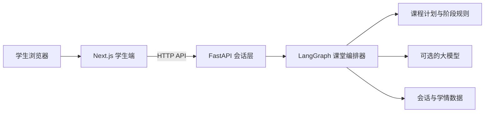
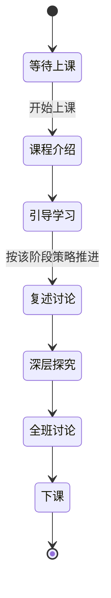

# 主动引导智能体——项目介绍（简化版）

## 1. 一句话介绍

这是一个面向课堂教学的“主动引导智能体”：老师先配置课程计划，系统再按照真实时间、学生回答证据和教师操作，自动完成“讲解 → 复述 → 深入探究 → 课堂讨论 → 下课总结”，并持续记录每名学生对各知识点的掌握情况。

它不是普通的“学生问一句、AI 答一句”的聊天机器人，而是一个由课程计划驱动、能够主动提问和自动推进的教学状态机。

## 2. 项目要解决什么问题

普通聊天机器人有三个明显问题：

1. 学生不提问，教学就停住；
2. 大模型容易自由发挥，课程顺序和课堂时间不可控；
3. 对话结束后只剩聊天记录，老师难以知道学生到底掌握了哪些知识点。

本项目的解决方式是：

- 用课程计划约束“教什么、按什么顺序教、每阶段多长时间”；
- 用 LangGraph 状态图约束“这一轮执行哪个步骤、何时切换阶段”；
- 用确定性规则判断“学生回答命中了多少证据、应该得到几星”；
- 让大模型只负责语言表达，不负责决定课程结构和分数；
- 将会话状态、掌握度变化和阶段快照持久化，课后可导出学情报告。

## 3. 系统整体结构



四个核心部分：

| 层 | 技术/目录 | 主要职责 |
| --- | --- | --- |
| 学生端 | `frontend/`，Next.js + React | 登录、加入课程、选课、视频、对话、阶段页面、课后报告 |
| 会话层 | `apps/server.py`，FastAPI | API、会话、心跳线程、并发锁、登录与课程码、导出 |
| 编排层 | `orchestrator/agent.py`，LangGraph | 课堂状态、教学节点、判星、切幕、内容生成 |
| 数据层 | `lesson-data/`、`rules/`、`stages/`、`runtime/` | 课程配置、教学规则、阶段题目、会话和学生档案 |

可以用一句话概括它们的关系：**前端是显示屏，会话层是连接器，编排器是导演，课程数据是剧本。**

## 4. 一节课是怎样运行的



当前内置课程是“处理机调度”，总时长 45 分钟：

| 阶段 | 当前配置 | 做什么 |
| --- | ---: | --- |
| 引导学习 | 22 分钟 | 播放完整教学视频；视频模式下 AI 保持安静 |
| 复述与讨论 | 9 分钟 | 学生用自己的话复述，系统识别遗漏并追问 |
| 深层探究 | 7 分钟 | 追问为什么、如何实现、解决什么实际问题 |
| 全班讨论 | 7 分钟 | 老师主导讨论，系统提供协助并记录阶段快照 |

课堂开始前，会话处于 `idle`，不计时；点击“开始上课”后变成 `running`。服务端每隔约 10 秒执行一次心跳，即使学生不发言，真实时间也会继续推进课堂。课程结束后状态变为 `ended`，可以导出学情。

## 5. 核心实现：可控状态机，而不是让大模型随意决定

每次学生发言、教师按钮事件或系统心跳，都会跑一遍 LangGraph：

```text
加载计划 → 计算时间 → 装配上下文 → 判断本轮类型
        → 教学/主持事件 → 判断掌握度 → 判断是否切幕
        → 切幕（可选）→ 写入状态 → 返回回复
```

图中共有 11 个主要节点：`load_plan`、`tick`、`load_context`、`classify_turn`、`host_event`、`teach`、`judge_mastery`、`judge_advance`、`advance_stage`、`write_state`、`format_reply`。

其中最关键的是两个判断：

- `judge_mastery`：根据学生原话是否命中知识点证据组，确定星级是否上升；
- `judge_advance`：综合教师事件、证据是否充分、最短时长和阶段预算，决定留在当前阶段还是进入下一阶段。

## 6. 大模型在系统中到底做什么

大模型是可选的。系统先用确定性代码算出：

- 当前应该讲哪一段；
- 应该问哪一道题；
- 学生回答完整、部分正确还是未命中；
- 是否切换阶段；
- 知识点应该升到几星。

然后才把这一轮的“教学指令”交给 OpenAI 兼容模型润色为自然中文。如果没有配置模型，或者模型请求失败，系统会使用模板文案继续上课。

因此，**模型影响的是表达质量，不影响课堂流程和评分结果**。这是项目最值得强调的设计。

## 7. 掌握度如何计算

项目使用 0～5 星知识点掌握度：

| 星级 | 含义 | 当前产生方式 |
| ---: | --- | --- |
| 0 | 未检测 | 没有学习证据 |
| 1 | 已接触 | 引导学习阶段讲过该知识点 |
| 2 | 初步理解 | 复述时命中部分证据 |
| 3 | 理解中 | 复述时命中全部证据组 |
| 4 | 接近掌握 | 深层探究时能完整说明机制/原因 |
| 5 | 已掌握 | 预留给正式考核；当前课堂流程不生成 |

星级只升不降。每次变化都会记录来源、阶段、学生原话和时间；每个阶段结束时还会保存一张快照，记录已关闭目标、未关闭目标和当时的星级。

## 8. 前端如何工作

前端采用 Next.js App Router，但课堂交互仍由 `src/legacy/` 中的模块化 JavaScript 兼容层负责。

前端自己不判断当前应该进入哪个教学阶段。它每 2 秒拉取一次会话状态和增量消息，然后读取后端返回的 `host_phase`：

```text
uninitialized → 课前页
intro / guided_learning → 介绍或讲解页
recap_discussion → 复述页
deep_inquiry → 深入思考页
class_discussion → 课堂讨论页
ending → 结束页
```

唯一的局部状态是视频页面：它属于 `guided_learning` 内部；视频播完后，前端调用 `/media/done` 通知后端切换到复述阶段。

## 9. 数据如何保存

- `runtime/sessions/<sid>.json`：完整课堂状态，服务重启后可继续；
- `runtime/students/<student_id>/mastery-state.json`：该学生当前掌握度；
- `runtime/students/<student_id>/mastery-history.json`：星级变化和阶段快照历史；
- `runtime/accounts.json`：学生账户
- `lesson-data/join-codes.json`：课程加入码；
- `/api/session/{sid}/export`：导出 Markdown 或 JSON 学情报告。

## 10. 项目当前已经实现的能力

- 学生注册、登录、退出；
- 使用课程码加入课程；
- 多课时读取与教师上传/覆盖课时；
- 一键构建前端并启动同源服务；
- 真实时间心跳与倍速彩排；
- 视频讲解和 AI 讲解两种模式；
- 主动提问、确定性证据匹配和星级更新；
- 教师强制切换下一环节；
- 会话恢复、按学生隔离的掌握档案；
- Markdown/JSON 学情导出；
- 后端集成测试、前端 lint 和 Playwright 端到端测试。

## 11. 当前边界与后续工作

介绍时不要把演示系统说成已可直接公网商用。当前主要边界是：

1. 教师上传课时等业务接口尚未做完整鉴权，不应直接暴露到公网；
2. 学生登录主要保护前端流程，部分业务接口还没有强制校验登录 Cookie；
3. 当前持久化以本地 JSON 文件为主，适合原型和单机演示，不适合多实例高并发；
4. 任意新课时虽然能上传，但确定性证据词典目前主要为内置的 `KP-001`～`KP-006` 配置；新知识点要补充可执行证据规则，才能自动判 2～4 星；
5. 5 星正式考核、教师管理界面、Webhook 推送和完整 SaaS 鉴权仍属于待扩展能力。

## 12. 明天介绍时可以直接这样说

> 我们做的不是一个普通问答机器人，而是一个可控的课堂编排系统。老师先把课拆成阶段、段落和知识点，LangGraph 再根据真实时间、学生回答证据和教师事件推进课堂。大模型只负责把系统已经决定好的教学动作说得更自然，所以即使模型不可用，课程仍然能按确定性逻辑运行。系统还会为每个学生保存知识点星级、证据和阶段快照，课后能够导出学情报告。前端只跟随服务端状态显示对应页面，从而保证整个课堂只有一个权威状态源。

## 13. 建议演示顺序

1. 双击根目录 `启动课堂.bat`；
2. 注册一个学生账号；
3. 输入内置课程码 `OSK7M3`；
4. 进入“操作系统 → 处理机调度”；
5. 点击“开始上课”；
6. 播放或跳过教学视频，观察页面自动进入复述；
7. 输入一段部分正确和一段较完整的回答，展示 AI 反馈；
8. 进入深入思考和课堂讨论；
9. 结束课程，展示掌握度和课后学情；
10. 最后打开 `lesson-data/lesson-plan.json` 和 `orchestrator/agent.py`，说明“数据决定课程，状态图决定流程，大模型只决定说法”。

---

更完整的代码级说明、调用时序、字段解释、接口清单和答辩问题，见 [项目介绍-极其详细版.md](./项目介绍-极其详细版.md)。
